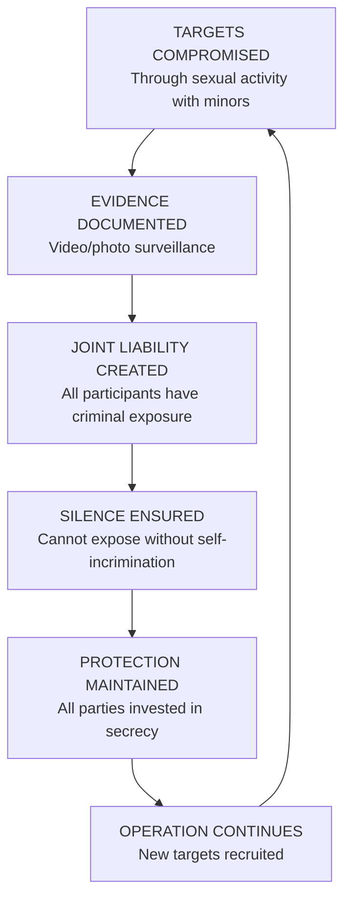

# THE EPSTEIN OPERATION

### A Comprehensive Analysis of a Multinational Criminal Enterprise

### From Intelligence Recruitment to Global Influence Network: 
        The Complete Story of Rise, Operation, and Collapse


Classification: Research Document

Version: 3.0 (Comprehensive Edition)

Date: February 3, 2026

Documents Analyzed: 29,930

Research Findings: 45

Images Processed: 72,646

Individuals Identified: 69

Author: Eugene Nayshtetik

License: CC BY-NC 4.0
                Creative Commons Attribution-NonCommercial 4.0 International

This work is licensed under a Creative Commons Attribution-NonCommercial 4.0 International License.
                You may share and adapt this material for noncommercial purposes, provided you give appropriate credit.

---

--- 

## TABLE OF CONTENTS

  * FRONT MATTER
  * Preface
  * Methodology
  * 1\. Data Collection
  * 2\. Database Architecture
  * 3\. Image Processing Pipeline
  * 4\. Knowledge Base Architecture
  * 5\. Research Methodology
  * 6\. Limitations and Caveats
  * Executive Summary
  * PART I: ORIGINS AND RECRUITMENT (1970s-1989)
  * Chapter 1: The Maxwell Intelligence Dynasty
  * 1.1 Robert Maxwell: The Triple Agent
  * 1.2 Intelligence Connections: Mossad, KGB, MI6
  * 1.3 Death and Legacy
  * Chapter 2: Ghislaine Maxwell - Heir to the Network
  * 2.1 Background and Education
  * 2.2 The Network Transfer
  * Chapter 3: Jeffrey Epstein's Rise
  * 3.1 Early Career: Bear Stearns
  * 3.2 Intercontinental Assets Group
  * 3.3 Towers Financial Involvement
  * 3.4 The Recruitment
  * PART II: THE WEXNER PARTNERSHIP (1987-2007)
  * Chapter 4: Capturing the Billionaire
  * 4.1 Leslie Wexner: The Target
  * 4.2 The Takeover
  * 4.3 Power of Attorney
  * 4.4 Assets Transferred
  * Chapter 5: The Mega Group Connection
  * 5.1 Origins and Membership
  * 5.2 Birthright Israel
  * 5.3 Wexner Israel Fellowship
  * 5.4 Think Tank Influence
  * 5.5 Epstein's Role as Gatekeeper
  * PART III: THE CRIMINAL ENTERPRISE
  * Chapter 6: The Business Model
  * 6.1 Revenue Streams
  * 6.2 The "Advisory Services" Fraud
  * 6.3 Corporate Structure and Shell Companies
  * 6.4 Banking Complicity
  * Chapter 7: The Trafficking Operation
  * 7.1 Organizational Structure
  * 7.2 Key Personnel
  * 7.3 Recruitment Methods
  * 7.4 Properties and Locations
  * 7.5 Transportation Network
  * Chapter 8: The Kompromat Machine
  * 8.1 Surveillance Infrastructure
  * 8.2 The Joint Liability Model
  * 8.3 Documented Leverage Attempts
  * 8.4 The "Client List" Question
  * 8.5 The US Intelligence Question
  * PART IV: THE INFLUENCE NETWORK
  * Chapter 9: Political Access
  * 9.1 United States: Clinton, Trump, and Others
  * 9.2 Israel: Barak and Intelligence Circles
  * 9.3 Russia: Belyakov and Putin Access
  * 9.4 United Kingdom: Prince Andrew
  * Chapter 10: Scientific and Academic Influence
  * 10.1 Harvard Funding and Connections
  * 10.2 MIT Media Lab Scandal
  * 10.3 The Edge Foundation Network
  * 10.4 The Transhumanist Agenda
  * Chapter 11: Pro-Israel Policy Achievements
  * 11.1 Birthright Israel: Measured Outcomes
  * 11.2 Wexner Fellowship: Training Israeli Leadership
  * 11.3 Diplomatic Achievements
  * 11.4 Think Tank and Media Influence
  * PART V: THE ROTHSCHILD CONNECTION
  * Chapter 12: Lynn Forester de Rothschild
  * 12.1 Flight Logs and Property Transactions
  * 12.2 The Clinton Letter
  * 12.3 Social Network Role
  * PART VI: THE DECLINE (2007-2019)
  * Chapter 13: The Wexner Betrayal
  * 13.1 The $46 Million Theft
  * 13.2 Financial Consequences
  * 13.3 Loss of Protection Infrastructure
  * Chapter 14: The 2008 Prosecution
  * 14.1 The FBI Investigation
  * 14.2 The "Sweetheart Deal"
  * 14.3 "Belonged to Intelligence"
  * Chapter 15: Continued Operations (2008-2019)
  * 15.1 Leon Black Extraction
  * 15.2 Escalating Blackmail Tactics
  * 15.3 Network Maintenance
  * Chapter 16: The Miami Herald Investigation
  * 16.1 Julie K. Brown's Work
  * 16.2 Impact and Consequences
  * Chapter 17: Arrest and Death
  * 17.1 The 2019 Arrest
  * 17.2 Circumstances of Death
  * 17.3 Suspicious Elements
  * 17.4 Expert Analysis
  * PART VII: AFTERMATH AND ANALYSIS
  * Chapter 18: Legal Consequences
  * 18.1 Maxwell Trial and Conviction
  * 18.2 Civil Settlements
  * 18.3 Document Releases
  * Chapter 19: The Integrated Model
  * 19.1 Convergence of Interests
  * 19.2 Why It Worked
  * 19.3 Why It Collapsed
  * Chapter 20: Final Assessment
  * 20.1 Primary Beneficiaries
  * 20.2 Unanswered Questions
  * 20.3 Historical Significance
  * APPENDICES
  * Appendix A: Key Persons Database
  * Appendix B: Financial Transactions
  * Appendix C: Corporate Entities
  * Appendix D: Intelligence Connections
  * Appendix E: Document Analysis
  * Appendix F: Facial Recognition Results
  * Appendix G: Research Findings (Complete)
  * Appendix H: Timeline of Key Events
  * Appendix I: Sources and Bibliography

--- 

# PREFACE

This report represents the culmination of extensive research into one of the most significant criminal operations of the modern era. The Jeffrey Epstein case transcends ordinary criminality—it reveals the intersection of intelligence operations, financial power, political influence, and systematic abuse that was protected for over three decades.

The investigation drew upon multiple sources:

  * **Primary Documents:** Analysis of 29,930 documents from the DOJ Epstein Library, including emails, financial records, flight logs, and corporate filings
  * **Investigative Journalism:** Reporting from the Miami Herald, Drop Site News, Dossier Center, and other investigative outlets
  * **Court Records:** Documents from the Maxwell trial, USVI litigation, and various civil suits
  * **Government Reports:** Senate Finance Committee investigations, DOJ Office of Professional Responsibility review, and FBI files
  * **Academic Research:** Studies from Brandeis University, MIT investigation reports, and Harvard inquiry findings
  * **Original Analysis:** Database construction, full-text search indexing, and facial recognition processing of 72,646 images


The goal of this report is not to sensationalize but to document—to create a comprehensive record of what is known, what remains uncertain, and what questions demand further investigation. The victims of this operation deserve a complete accounting, and the mechanisms that enabled it must be understood to prevent recurrence.

> Important Note on Evidence: 
> This report distinguishes between confirmed facts, documented allegations, and analytical conclusions. Evidence levels are noted throughout. Some claims remain disputed, and official denials are included where relevant. Readers should evaluate the evidence and reach their own conclusions.  --- 

# METHODOLOGY

This investigation employed a systematic, multi-phase methodology combining database engineering, natural language processing, computer vision, and analytical synthesis. This section documents the technical architecture and processes used to analyze the evidence.

## 1\. Data Collection

### 1.1 Primary Data Sources

The investigation drew upon seven primary data sources:

Source | Type | Volume | Description  
---|---|---|---  
DOJ Epstein Library | Government Release | 3+ million pages | January 2026 release of federal investigation documents  
Internet Archive | Aggregated Collection | Combined Epstein Files | Publicly archived documents and images  
House Oversight Records | Congressional | Variable | Congressional investigation materials  
Senate Finance Committee | Congressional | JPMorgan/Black investigation | Banking and financial records  
Court Documents | Legal | Multiple cases | Maxwell trial, Giuffre lawsuits, USVI litigation  
Dossier Center | Investigative | Russian connections | FSB and Belyakov documentation  
Torrent Collections | Aggregated | 79GB / 504,539 files | Comprehensive document collections (DataSets 1-10)  
  
### 1.2 Document Acquisition Process


```mermaid
flowchart LR
        subgraph Sources["DATA SOURCES"]<br/>DOJ["DOJ Library"]<br/>IA["Internet Archive"]<br/>Court["Court Records"]<br/>Senate["Senate Finance"]<br/>end

        subgraph Process["PROCESSING"]<br/>Extract["Document
Extraction"]<br/>OCR["OCR
Processing"]<br/>Index["Full-Text
Indexing"]<br/>Store["Database
Storage"]<br/>end

        subgraph Output["OUTPUT"]<br/>DB["SQLite
Database"]<br/>FTS["FTS5
Search Index"]
        end

        DOJ --> Extract
        IA --
> Extract
        Court --> Extract
        Senate --
> Extract
        Extract --> OCR
        OCR --
> Index
        Index --> Store
        Store --
> DB
        Store --> FTS
```
 

## 2\. Database Architecture

### 2.1 Technology Stack

Component | Technology | Purpose  
---|---|---  
Database Engine | SQLite 3 | Portable, serverless relational database  
Full-Text Search | SQLite FTS5 | High-performance text search across 29,930 documents  
OCR Processing | Tesseract / Adobe Extract | Text extraction from scanned documents  
Image Processing | Python / PIL | Image extraction and preprocessing  
Facial Recognition | DeepFace / VGG-Face | Face detection and embedding generation  
Analysis Scripts | Python 3.x | Custom analysis pipelines  
  
### 2.2 Database Schema

The database consists of eight interrelated tables designed to capture documents, persons, financial flows, corporate structures, intelligence connections, relationships, research findings, and facial recognition results:


```mermaid
erDiagram
        DOCUMENTS {
            int id PK
            text file_path
            text efta_id
            text ocr_text
            int file_size
            text date_added
        }

        PERSONS {
            int id PK
            text name UK
            text category
            text role
            int document_mentions
            int photo_appearances
        }

        FINANCIAL_TRANSACTIONS {
            int id PK
            text date
            text payer
            text recipient
            real amount
            text purpose
        }

        ENTITIES {
            int id PK
            text name UK
            text type
            text jurisdiction
            text purpose
        }

        INTELLIGENCE_CONNECTIONS {
            int id PK
            text person
            text agency
            text evidence_level
            text source
        }

        RELATIONSHIPS {
            int id PK
            text person1
            text person2
            text relationship_type
        }

        RESEARCH_FINDINGS {
            int id PK
            text category
            text subject
            text finding
            text confidence
        }

        IDENTIFIED_FACES {
            int id PK
            int cluster_id
            text identity
            int photo_count
            text representative_image
        }

        PERSONS ||--o{ FINANCIAL_TRANSACTIONS : "pays/receives"<br/>PERSONS ||--o{ INTELLIGENCE_CONNECTIONS :"connected to"<br/>PERSONS ||--o{ RELATIONSHIPS :"related to"<br/>PERSONS ||--o{ IDENTIFIED_FACES :"appears in"<br/>ENTITIES ||--o{ FINANCIAL_TRANSACTIONS :"involved in"
```
 

### 2.3 Table Statistics

Table | Records | Purpose  
---|---|---  
`documents` | 29,930 | Primary document storage with OCR text  
`documents_fts` | 29,930 | FTS5 virtual table for full-text search  
`persons` | 18 | Key individuals (perpetrators, victims, financiers, etc.)  
`financial_transactions` | 9 | Documented money flows  
`entities` | 13 | Corporations, trusts, shell companies  
`intelligence_connections` | 8 | Links to intelligence agencies  
`relationships` | 13 | Connections between individuals  
`research_findings` | 45 | Compiled research conclusions  
`identified_faces` | 69 | Facial recognition clustering results  
  
### 2.4 Full-Text Search Implementation

The investigation required the ability to search across nearly 30,000 documents for specific terms, names, and patterns. SQLite's FTS5 extension provides high-performance full-text search with features including:

  * **Boolean queries:** Support for AND, OR, NOT operators
  * **Phrase search:** Exact phrase matching with quotes
  * **Prefix search:** Wildcard matching (e.g., "Putin*")
  * **Ranking:** BM25 relevance scoring for result ordering
  * **Highlighting:** Snippet extraction showing match context

> Example Query: Finding Russia-Related Documents 
> > 
> SELECT * FROM documents_fts WHERE documents_fts MATCH 'Putin AND meeting'; > 
> > This query searches for documents containing both "Putin" and "meeting" anywhere in the OCR text, returning results ranked by relevance. 

## 3\. Image Processing Pipeline

### 3.1 Image Extraction

Images were extracted from PDF documents and archived collections using a multi-step pipeline:


```mermaid
flowchart TD
        subgraph Input["INPUT"]<br/>PDF["PDF Documents"]<br/>IMG["Image Archives"]<br/>end

        subgraph Extract["EXTRACTION"]<br/>E1["PDF Image
Extraction
(extract_pdf_images.py)"]<br/>E2["Archive
Unpacking"]<br/>end

        subgraph Process["PROCESSING"]<br/>P1["Format
Normalization"]<br/>P2["Quality
Filtering"]<br/>P3["Deduplication"]<br/>end

        subgraph Output["OUTPUT"]<br/>OUT["72,646 Images
(extracted_images/)"]
        end

        PDF --> E1
        IMG --
> E2
        E1 --> P1
        E2 --
> P1
        P1 --> P2
        P2 --
> P3
        P3 --> OUT
```
  Metric | Count  
---|---  
Total images extracted | 72,646  
Source PDF documents | ~10,000  
Average images per PDF | 7.3  
  
### 3.2 Facial Recognition Pipeline

Facial recognition analysis was conducted to identify individuals appearing in photographs throughout the document corpus:

#### 3.2.1 Technology

Component | Technology | Purpose  
---|---|---  
Face Detection | DeepFace (MTCNN backend) | Locate faces within images  
Feature Extraction | VGG-Face model | Generate 2048-dimensional face embeddings  
Clustering | Cosine similarity + agglomerative clustering | Group similar faces into identity clusters  
Verification | Manual review | Confirm cluster identities  
  
#### 3.2.2 Processing Pipeline


```mermaid
flowchart TD
        subgraph Phase1["PHASE 1: DETECTION"]<br/>A1["72,646 Images"]<br/>A2["Face Detection
(face_recognition.py)"]<br/>A3["796 Faces
in 526 Images"]<br/>end

        subgraph Phase2["PHASE 2: EMBEDDING"]<br/>B1["Face Cropping"]<br/>B2["VGG-Face
Embedding"]<br/>B3["2048-dim
Vectors"]<br/>end

        subgraph Phase3["PHASE 3: CLUSTERING"]<br/>C1["Similarity
Matrix"]<br/>C2["Agglomerative
Clustering"]<br/>C3["69 Identity
Clusters"]<br/>end

        subgraph Phase4["PHASE 4: IDENTIFICATION"]<br/>D1["Representative
Selection"]<br/>D2["Manual
Verification"]<br/>D3["Identified
Individuals"]
        end

        A1 --> A2 --
> A3
        A3 --> B1 --
> B2 --> B3
        B3 --
> C1 --> C2 --
> C3
        C3 --> D1 --
> D2 --> D3
```
 

#### 3.2.3 Results Summary

Stage | Input | Output  
---|---|---  
Image Processing | 72,646 images | 526 images with faces  
Face Detection | 526 images | 796 detected faces  
Clustering | 796 face embeddings | 69 unique identity clusters  
Identification | 69 clusters | Key figures positively identified  
  
## 4\. Knowledge Base Architecture

### 4.1 Hierarchical Organization

The knowledge base is organized into interconnected layers:


```mermaid
flowchart TD
        subgraph Layer1["LAYER 1: RAW DATA"]<br/>L1A["29,930 Documents"]<br/>L1B["72,646 Images"]<br/>L1C["Flight Logs"]<br/>L1D["Financial Records"]<br/>end

        subgraph Layer2["LAYER 2: STRUCTURED DATA"]<br/>L2A["SQLite Database"]<br/>L2B["FTS5 Index"]<br/>L2C["Face Embeddings"]<br/>L2D["Entity Tables"]<br/>end

        subgraph Layer3["LAYER 3: ANALYSIS"]<br/>L3A["Research Findings
(45 findings)"]<br/>L3B["Relationship Map"]<br/>L3C["Financial Flows"]<br/>L3D["Timeline"]<br/>end

        subgraph Layer4["LAYER 4: SYNTHESIS"]<br/>L4A["Comprehensive Report"]<br/>L4B["Visualizations"]<br/>L4C["Conclusions"]
        end

        L1A --> L2A
        L1B --
> L2C
        L1C --> L2A
        L1D --
> L2A
        L2A --> L3A
        L2B --
> L3A
        L2C --> L3B
        L2D --
> L3C
        L3A --> L4A
        L3B --
> L4A
        L3C --> L4B
        L3D --
> L4A
```
 

### 4.2 Analysis Script Library

A suite of Python scripts was developed to automate analysis tasks:

Script | Purpose | Output  
---|---|---  
`build_inventory.py` | Create initial document database | documents table populated  
`extract_full_content.py` | OCR text extraction | ocr_text fields populated  
`extract_pdf_images.py` | Extract images from PDFs | 72,646 image files  
`face_recognition.py` | Full facial detection pipeline | faces_comprehensive.json  
`cluster_faces.py` | Cluster faces by similarity | Identity clusters  
`identify_faces.py` | Generate cluster representatives | identified_individuals.json  
`extract_all_persons.py` | Extract names from documents | all_persons.txt (946 names)  
`build_expanded_graph.py` | Create network graph for Gephi | Relationship visualization  
`query_db.py` | Interactive database queries | Ad-hoc analysis results  
`export_database.py` | Export data for reporting | CSV/JSON exports  
  
### 4.3 File System Organization

> Project Directory Structure 
> > 
> > C:/Projects/Epstein/ 
> ├── database/ > │ ├── report/ 
> │ │ ├── EPSTEIN_REPORT_FULL.html # This report > │ │ └── VISUALIZATION_CATALOG.md # Diagram specifications 
> │ ├── face_clusters/ > │ │ ├── identified_individuals.json 
> │ │ └── IDENTIFIED_PERSONS.md > │ ├── faces_comprehensive.json # 796 face detections 
> │ ├── *.md # Analysis documents > │ └── *.py # Analysis scripts 
> ├── extracted_images/ # 72,646 extracted images > ├── DOJ_Datasets/ # Federal documents 
> ├── House_Oversight/ # Congressional records > ├── Internet_Archive/ # Archived collections 
> └── Torrents/ > └── DataSet 10.zip # 79GB comprehensive collection 

## 5\. Research Methodology

### 5.1 Evidence Classification

All findings in this report are classified according to evidence strength:

Classification | Definition | Example  
---|---|---  
**Confirmed** | Multiple independent sources, official records, or undisputed documents | Maxwell conviction; Wexner $46M theft acknowledgment  
**Documented** | Supported by primary documents (emails, records, photographs) | Barak 30+ visits; Gates blackmail drafts  
**High Confidence** | Strong circumstantial evidence from credible sources | Mossad connection via Maxwell funeral  
**Medium Confidence** | Credible reporting, limited corroboration | KGB ties to Robert Maxwell  
**Alleged/Suspected** | Single source claims, unverified assertions | Specific unreleased recordings  
  
### 5.2 Source Triangulation

Key findings were verified through source triangulation—seeking confirmation from multiple independent sources:

  * **Primary documents** (emails, financial records, court filings)
  * **Investigative journalism** (Miami Herald, Drop Site News, WSJ)
  * **Government reports** (DOJ, Senate Finance Committee)
  * **Academic research** (Brandeis University, MIT investigation)
  * **Witness testimony** (depositions, trial transcripts)


### 5.3 Research Finding Categories

The 45 research findings are organized into 10 categories:

Category | Findings | Focus  
---|---|---  
Operation Success | 6 | What the operation achieved  
Intelligence | 6 | Agency connections and operations  
Conspiracy Aims | 6 | Strategic objectives  
Concrete Achievements | 6 | Measurable policy outcomes  
Kompromat Theory | 5 | Joint liability mechanism  
Financial | 5 | Money flows and extraction  
Rothschild | 4 | Rothschild family connections  
Facial Recognition | 3 | Image analysis results  
Documents | 2 | Corpus analysis  
Analysis | 2 | Integrated assessments  
  
## 6\. Limitations and Caveats

### 6.1 Known Limitations

  * **Incomplete corpus:** Not all Epstein-related documents have been released; classified materials remain inaccessible
  * **OCR quality:** Some documents are degraded or poorly scanned, resulting in OCR errors
  * **Facial recognition accuracy:** Clustering may group or separate faces incorrectly; not all individuals could be identified
  * **Source reliability:** Some investigative claims remain unverified by independent sources
  * **Temporal coverage:** Earlier periods (1980s-1990s) have less documentation than later periods


### 6.2 Analytical Caveats

  * Correlation does not establish causation; documented connections do not prove criminal involvement
  * Official denials are noted where relevant; readers should consider all perspectives
  * Intelligence operations are inherently difficult to verify; assessments rely on pattern analysis
  * Some conclusions are based on analytical inference rather than direct evidence


### 6.3 Reproducibility

The investigation methodology is designed to be reproducible:

  * All queries and analysis scripts are documented and available
  * Source citations are provided for all external findings
  * Evidence classifications are explicitly stated throughout

--- 

# EXECUTIVE SUMMARY


> Core Findings > 
> > This investigation concludes that the Jeffrey Epstein operation was a sophisticated, multinational enterprise that combined criminal trafficking with intelligence operations, financial extraction, and political influence. The operation functioned for over 30 years, extracting more than $500 million from billionaire "clients" while building a network of compromised individuals across political, financial, and scientific sectors. 

## The Scale of the Operation

| Value | Description | |-------|-------------| | **$500M+** | Extracted from Billionaires | | **30+** | Years of Operation | | **29,930** | Documents Analyzed | | Value | Description | |-------|-------------| | **900K** | Birthright Participants | | **280+** | Israeli Officials Trained | | **$1.3B** | Suspicious Bank Transactions | 

## The Five Pillars of the Operation

The Epstein operation served five overlapping strategic objectives:

### 1\. Intelligence Collection

The creation of a vast database of compromising material (kompromat) on global elites through systematic surveillance and documentation of criminal activity. Evidence includes hidden cameras at properties, FBI memos referencing Mossad connections, and the statement by U.S. Attorney Acosta that Epstein "belonged to intelligence."

### 2\. Financial Extraction

The systematic extraction of hundreds of millions of dollars from billionaire "clients" for vague "advisory services" that Epstein was unqualified to provide. Primary sources: Leslie Wexner ($200M+) and Leon Black ($158-170M). The pattern suggests payments were for silence, access, or compliance with blackmail rather than legitimate services.

### 3\. Political Influence

Access to and potential leverage over world leaders including U.S. presidents, Israeli prime ministers, British royalty, and Russian officials. Documented relationships include Bill Clinton (16+ flights), Donald Trump (1990s social connection), Prince Andrew (extensive documentation), and Ehud Barak (30+ meetings).

### 4\. Scientific/Eugenic Agenda

Funding of research aligned with transhumanist goals, including plans to "seed the human race" with Epstein's DNA through impregnating 20+ women, cryonics (freezing head and reproductive organs), and funding genetic research at Harvard ($6.5M) and MIT ($7.5M+).

### 5\. Pro-Israel Policy Advancement

Through the Mega Group network founded by Wexner, the operation funded initiatives with measurable impact: Birthright Israel (900,000+ participants with documented attitude shifts), Wexner Fellowship (280+ Israeli officials trained at Harvard, including the IDF Chief of Staff), and think tank influence over U.S. Middle East policy.

## The Protection Mechanism

The operation survived for three decades through a self-reinforcing system of mutual liability:



 

This "joint liability model" explains why:

  * The 2008 prosecution resulted in a "sweetheart deal" with immunity for co-conspirators
  * Major banks processed $1.3 billion in suspicious transactions without reporting
  * Elite institutions continued accepting Epstein's funding after his conviction
  * Only one person (Maxwell) was ever prosecuted besides Epstein himself


## The Collapse

The operation finally collapsed due to a combination of factors:

  1. **Internal Betrayal (2007):** Epstein stole $46 million from his primary patron, Leslie Wexner, destroying that relationship and degrading his protection infrastructure
  2. **Investigative Journalism (2018):** The Miami Herald's "Perversion of Justice" series, interviewing 80 victims, created unavoidable public pressure
  3. **Jurisdictional Loophole (2019):** SDNY prosecutors determined they were not bound by the 2008 Florida non-prosecution agreement
  4. **Death in Custody (2019):** Epstein died under suspicious circumstances before trial, silencing the primary witness


## Primary Beneficiaries

Beneficiary | Primary Achievements | Documented Scale  
---|---|---  
**Israel/Pro-Israel Network** | Birthright program, leadership training, security agreements, think tank influence, diplomatic backchannels | 900K program participants, 280+ officials trained, IDF Chief of Staff, security deals with Mongolia and Ivory Coast  
**Epstein Personally** | Wealth accumulation, scientific prestige, elite social access, properties | $559M at death, properties on 3 continents, network of world leaders  
**Intelligence Services** | Kompromat collection, diplomatic backchannels, information access | Unknown—surveillance material never surfaced publicly  
  
## Unanswered Questions

Critical questions remain unresolved:

  1. Where are the surveillance recordings from Epstein's properties?
  2. Which intelligence service(s) ultimately controlled the operation?
  3. How many individuals were compromised, and who holds leverage over them?
  4. What is contained in the classified Treasury and DOJ files?
  5. Was Epstein murdered, and if so, by whom?
  6. Why were no other co-conspirators besides Maxwell prosecuted?

--- 

Part I

# ORIGINS AND RECRUITMENT

1970s - 1989

--- 

Chapter 1

## The Maxwell Intelligence Dynasty

### 1.1 Robert Maxwell: The Triple Agent

Understanding the Epstein operation requires beginning not with Jeffrey Epstein, but with **Robert Maxwell** —the British media mogul whose intelligence connections provided the infrastructure for everything that followed. Maxwell's story illuminates how intelligence services cultivate assets in the private sector and how those networks can persist across generations.

#### 1.1.1 Origins

Robert Maxwell was born **Ján Ludvík Hyman Binyamin Hoch** on June 10, 1923, in Slatinské Doly, Czechoslovakia (now Ukraine), to a poor Orthodox Jewish family. His early life was marked by tragedy—most of his family was killed in the Holocaust at Auschwitz. Maxwell escaped, eventually making his way to Britain where he joined the British Army.

During World War II, Maxwell served with distinction, earning the Military Cross for bravery. He changed his name to Ian Robert Maxwell and became a British citizen. After the war, he leveraged his language skills (he spoke nine languages) and military connections to begin building a business empire.

Date | Event | Significance  
---|---|---  
1923 | Born in Czechoslovakia | Jewish family, most killed in Holocaust  
1940 | Escaped to Britain | Joined British Army  
1945 | Military Cross awarded | Decorated war hero  
1947 | Founded Pergamon Press | Scientific publishing empire begins  
1964-1970 | Member of Parliament | Labour Party, Buckingham constituency  
1984 | Acquired Mirror Group | Major British newspaper chain  
1988 | Acquired Macmillan Publishers | US publishing presence  
1991 | Death at sea | Fell from yacht under mysterious circumstances  
  
#### 1.1.2 Building the Media Empire

Maxwell's business acumen was formidable. He built Pergamon Press into one of the world's leading scientific publishers, recognizing early the value of controlling academic information. The company published thousands of scientific journals, giving Maxwell access to cutting-edge research and relationships with scientists worldwide.

In 1984, Maxwell acquired Mirror Group Newspapers, which published the Daily Mirror and other British tabloids. This gave him significant influence over British public opinion. He later acquired Macmillan Publishers in the United States, extending his reach across the Atlantic.

At his peak, Maxwell controlled a media empire worth billions, employed thousands of people, and wielded considerable political influence in both Britain and internationally.

### 1.2 Intelligence Connections: Mossad, KGB, MI6

Robert Maxwell maintained documented relationships with **at least three intelligence services** , a pattern so unusual that it earned him various designations including "triple agent" and "super-spy."

#### 1.2.1 Mossad Connection: Confirmed

The evidence for Maxwell's relationship with Israeli intelligence (Mossad) is the most conclusive and comes from multiple sources:


> Evidence Category: PROMIS Software > 
> > Maxwell allegedly served as Mossad's broker for PROMIS (Prosecutor's Management Information System), a U.S. Department of Justice database software. According to multiple investigative accounts, the software had been modified to include a "backdoor" allowing Israeli intelligence to monitor any government that purchased it. 
> > 
> Maxwell's publishing and business networks gave him access to governments worldwide, making him an ideal distributor. The PROMIS software was allegedly sold to intelligence agencies in numerous countries, providing Israel with an unprecedented surveillance capability. > 
> > Source: 
> Gordon Thomas, "Gideon's Spies: The Secret History of the Mossad" > Evidence Category: Mordechai Vanunu 
> > 
> In 1986, Israeli nuclear technician Mordechai Vanunu was preparing to expose Israel's secret nuclear weapons program to the British press. According to Ari Ben-Menashe, a former Israeli Military Intelligence officer, Maxwell informed the Israeli Embassy of Vanunu's plans. > 
> > Vanunu was subsequently lured to Rome by a Mossad agent, kidnapped, smuggled back to Israel, and imprisoned for 18 years. Maxwell's role in this affair, if accurate, demonstrates active operational involvement with Israeli intelligence. 
> > 
> Source: > Ari Ben-Menashe, "Profits of War" 
> Evidence Category: State Funeral > 
> > When Maxwell died on November 5, 1991, the Israeli state response was extraordinary—inconsistent with treatment of an ordinary businessman but consistent with recognition of a major intelligence asset: 
> > 
> > 
> Buried on the > Mount of Olives 
> , Jerusalem—Israel's most prestigious cemetery, reserved for the most honored figures in Jewish history > 
> > Attended by Israeli 
> President Chaim Herzog > 
> > Attended by 
> Prime Minister Yitzhak Shamir > 
> > Six serving and former heads of Israeli intelligence 
> were present 

> "He has done more for Israel than can today be said." — Prime Minister Yitzhak Shamir, eulogy for Robert Maxwell, November 1991

This statement from the sitting Israeli Prime Minister strongly implies classified services that could not be publicly discussed—the hallmark of intelligence work.

#### 1.2.2 KGB Connection: Suspected

British Foreign Office files, now partially declassified, reveal that British officials harbored serious suspicions about Maxwell's Soviet connections:


> Robert Maxwell was assessed as a "thoroughly bad character" who was "almost certainly financed by Russia." — British Foreign Office assessment

Maxwell's extensive business dealings with Soviet bloc countries during the Cold War provided cover for potential intelligence activities. His publishing empire included distribution of Soviet scientific literature in the West, creating legitimate reasons for regular contact with Soviet officials.

The British assessment suggests that Maxwell may have been receiving Soviet funding—potentially in exchange for intelligence or influence operations. This would make him a double agent, serving both Israeli and Soviet interests.

#### 1.2.3 MI6 Connection: Documented

Maxwell also had "known links" to British intelligence (MI6), according to declassified documents. Given his wartime service, his media influence, and his international business activities, Maxwell would have been a natural asset for British intelligence to cultivate.

Some analysts suggest Maxwell operated as a **triple agent** , providing intelligence to Israeli, Soviet, and British services simultaneously. Whether any one service was his primary loyalty, or whether he played all three against each other for personal advantage, remains unclear.

#### 1.2.4 The Intelligence Asset Model


```mermaid
flowchart TD
        RM["ROBERT MAXWELL<br/>Media Mogul / Intelligence Asset"]

        subgraph Services["INTELLIGENCE SERVICES"]<br/>MOSSAD["MOSSAD
(Israeli)"]<br/>KGB["KGB
(Soviet)"]<br/>MI6["MI6
(British)"]<br/>end

        subgraph Assets["ASSETS PROVIDED"]<br/>MEDIA["Media Influence"]<br/>ACCESS["Government Access"]<br/>DIST["Distribution Networks"]<br/>INFO["Information/Intelligence"]
        end

        MOSSAD <--> RM
        KGB <-.-
> RM
        MI6 <-.-> RM

        RM --
> MEDIA
        RM --> ACCESS
        RM --
> DIST
        RM --> INFO
```
 

### 1.3 Death and Legacy

#### 1.3.1 The Mysterious Death

On November 5, 1991, Robert Maxwell's body was found floating in the Atlantic Ocean near the Canary Islands. He had fallen from his yacht, the _Lady Ghislaine_ (named after his daughter), during the night.

The circumstances remain disputed:

Theory | Supporting Evidence | Problems  
---|---|---  
**Accident** | Heart attack, fell overboard | Would require extraordinary bad luck  
**Suicide** | Business empire collapsing, pension fraud about to be exposed | Maxwell's personality inconsistent with suicide  
**Murder (Mossad)** | He knew too much, becoming liability, financial desperation made him unreliable | Would kill a major asset?  
**Murder (Other)** | Multiple enemies in intelligence world, business rivals | Who specifically?  
  
After Maxwell's death, it emerged that he had looted approximately £440 million from his companies' pension funds to shore up his failing business empire. This fraud left thousands of employees without their pensions.

#### 1.3.2 The Network Survives

Crucially, Maxwell's death did not destroy his intelligence network—it created a succession problem. The relationships, tradecraft, and connections he had built over decades still existed. Someone would inherit them.

That someone was his daughter, Ghislaine.

--- 

Chapter 2

## Ghislaine Maxwell: Heir to the Network

### 2.1 Background and Education

**Ghislaine Noelle Marion Maxwell** was born on December 25, 1961, in Maisons-Laffitte, France, the youngest of Robert Maxwell's nine children. Her name, pronounced "Ghi-LANE," reportedly combined "Ghislaine" from a family friend with elements meaningful to her parents.

Ghislaine was, by all accounts, her father's favorite child. Robert Maxwell named his yacht after her—the _Lady Ghislaine_ —a vessel that would later play a role in his death. This favoritism meant Ghislaine had unique access to her father's world, including potentially his intelligence connections.

Aspect | Details  
---|---  
Birth | December 25, 1961, France  
Education | Marlborough College; Oxford University (Balliol College), Modern History and Languages  
Languages | English, French, Spanish  
Father's Company Roles | Director of Oxford United Football Club (Maxwell-owned)  
Social Position | London society figure, later New York socialite  
  
### 2.2 The Network Transfer

Following Robert Maxwell's death in November 1991, Ghislaine relocated to New York City. The timing is significant: she moved within weeks of her father's death, before the full extent of his financial fraud was exposed.

In New York, Ghislaine quickly established herself in elite social circles. She was seen at the best parties, knew the right people, and cultivated an image as a sophisticated British socialite. Within a year, she had met Jeffrey Epstein.

**The Network Transfer Hypothesis:** Intelligence sources have suggested that Ghislaine inherited more than money from her father—she inherited his intelligence connections. The relationships Robert Maxwell had built with Mossad and potentially other services did not simply disappear at his death. Ghislaine, as his favorite and most trusted child, was the logical inheritor. 

#### 2.2.1 What Ghislaine Brought

Ghislaine Maxwell brought several crucial assets to her eventual partnership with Epstein:

  1. **Social Access:** Entry to elite circles in Britain, Europe, and the United States. Her family connections opened doors that money alone could not.
  2. **Intelligence Relationships:** Whatever connections her father had maintained with Mossad and other services, Ghislaine was positioned to continue them.
  3. **Operational Knowledge:** Having observed her father's methods for decades, Ghislaine understood how to cultivate relationships, maintain networks, and operate in the gray zones between business, society, and intelligence.
  4. **Recruitment Skills:** Ghislaine would later demonstrate a sophisticated ability to identify, approach, and manipulate young women for the trafficking operation—skills that suggest training or extensive practice.


```mermaid
flowchart TD
        subgraph Father["ROBERT MAXWELL (d. 1991)"]<br/>F1["Mossad Relationships"]<br/>F2["Intelligence Tradecraft"]<br/>F3["Elite Social Network"]<br/>F4["Operational Methods"]<br/>end

        subgraph Transfer["NETWORK TRANSFER"]<br/>T["Ghislaine inherits
father's network"]<br/>end

        subgraph Daughter["GHISLAINE MAXWELL"]<br/>D1["Intelligence Contacts"]<br/>D2["Operational Knowledge"]<br/>D3["Social Access"]<br/>D4["Recruitment Skills"]
        end

        Father --> Transfer
        Transfer --
> Daughter
```
 --- 

Chapter 3

## Jeffrey Epstein's Rise

### 3.1 Early Career: Bear Stearns

**Jeffrey Edward Epstein** was born on January 20, 1953, in Brooklyn, New York, to Seymour Epstein, a groundskeeper for the New York City Parks Department, and Pauline Epstein, a homemaker and later a school aide. He grew up in a middle-class Jewish family in the Sea Gate neighborhood of Coney Island.

Epstein attended public schools and reportedly showed early aptitude in mathematics. However, his educational record contains significant gaps and inconsistencies.

#### 3.1.1 The Dalton School (1973-1975)

In 1973, at age 20, Epstein was hired to teach mathematics and physics at the prestigious Dalton School on Manhattan's Upper East Side. This position was unusual for several reasons:

  * Epstein had **not completed a college degree** (he dropped out of both NYU and Cooper Union)
  * The Dalton School was (and is) one of the most elite private schools in America
  * He was hired by headmaster **Donald Barr** —father of future Attorney General William Barr

> Pattern Recognition: 
> This early instance of unexplained advancement—a college dropout hired to teach at an elite institution—would repeat throughout Epstein's career. Each advancement defies normal explanation but makes sense if Epstein had patrons or sponsors working behind the scenes. 

At Dalton, Epstein taught the children of wealthy and powerful New York families. Former students later recalled him as charismatic but inappropriate, allegedly commenting on students' appearances and dating young women barely older than his students.

Epstein left Dalton in 1975 under circumstances that remain unclear. Some accounts suggest he was fired; others indicate he departed voluntarily.

#### 3.1.2 Bear Stearns (1976-1981)

In 1976, Epstein joined Bear Stearns, one of Wall Street's largest investment banks, as a low-level employee. His rise was meteoric:

\- **1976** — Hired as entry-level assistant to floor traders \- **1977-79** — Rapid advancement through trading ranks \- **1980** — Made limited partner—youngest in firm history \- **1981** — Departed under unclear circumstances 

Bear Stearns CEO Alan "Ace" Greenberg reportedly saw potential in Epstein and mentored his rise. However, the exact nature of Epstein's work at Bear Stearns remains murky. He apparently specialized in working with wealthy clients who had tax problems—a niche that required both financial sophistication and discretion.

In 1981, Epstein left Bear Stearns. The circumstances are disputed:

  * Some accounts cite a "policy violation" (nature unspecified)
  * Others suggest pressure from senior partners
  * Epstein himself claimed voluntary departure to start his own firm


### 3.2 Intercontinental Assets Group (1981-1987)

After leaving Bear Stearns, Epstein founded **Intercontinental Assets Group Inc. (IAG)** , operating from offices on Madison Avenue. He described his work as that of a "bounty hunter" for the ultra-wealthy:

> Epstein described his work at this time as being a high-level bounty hunter. He told friends that he worked sometimes as a consultant for governments and the very wealthy to recover embezzled funds, while **at other times he worked for clients who had embezzled funds**. 

This admission is remarkable. Epstein openly acknowledged working both sides—helping fraud victims recover money, and helping fraudsters protect stolen money. This moral flexibility would characterize his entire career.

### 3.3 Towers Financial Involvement

In the 1980s, Epstein became involved with **Towers Financial Corporation** , an investment firm run by Steven Hoffenberg. In 1993, Towers collapsed in one of the largest Ponzi schemes in American history, with losses exceeding $450 million.

Aspect | Details  
---|---  
Scheme Size | $450+ million (equivalent to ~$1 billion in 2024)  
Hoffenberg's Claim | Epstein was "intimately involved" in the fraud  
Epstein's Departure | Left company by 1989, before collapse  
Charges Against Epstein | None—never charged  
Hoffenberg's Sentence | 18 years in federal prison  

> The Pattern: > Epstein extracted value from Towers Financial and departed before the collapse. He was never charged despite Hoffenberg's claims of intimate involvement. This pattern—extraction followed by escape while others face consequences—would repeat with Wexner. 

### 3.4 The Recruitment

By the late 1980s, Epstein had established himself as a financial consultant to the ultra-wealthy, operating in the shadows with no regulatory filings, no public profile, and a carefully cultivated air of mystery.

The exact mechanism of his recruitment into intelligence networks remains unclear. Three theories have been advanced:

##### Theory 1: Maxwell Introduction

Intelligence sources have suggested that an "oil tycoon working for Russian intelligence connected Epstein to Maxwell and KGB." This would place the introduction in the context of the Maxwell family's multi-agency intelligence operations.

##### Theory 2: Wexner/Mega Group Channel

Epstein's capture of Leslie Wexner as a client in 1987 may have been the entry point. Wexner was a co-founder of the Mega Group, which some intelligence analysts believe had connections to Israeli intelligence operations in the United States.

##### Theory 3: Organic Development

Epstein may have developed intelligence utility independently through his financial expertise, social skills, and willingness to operate without moral constraints. This would make him attractive to multiple services as a freelance asset.

Regardless of the exact mechanism, by the early 1990s, Epstein was positioned at the nexus of several networks:

  * Control of a billionaire's fortune (Wexner)
  * Relationship with an intelligence-connected socialite (Ghislaine Maxwell)
  * Access to elite social and financial circles
  * A demonstrated willingness to operate outside legal and ethical boundaries


The stage was set for the next phase: building the criminal enterprise.

--- 

Part II

# THE WEXNER PARTNERSHIP

1987 - 2007

--- 

Chapter 4

## Capturing the Billionaire

### 4.1 Leslie Wexner: The Target

**Leslie Herbert Wexner** , born September 8, 1937, in Dayton, Ohio, built one of the most successful retail empires in American history. From a single women's clothing store opened in 1963, he created L Brands, which at its peak included Victoria's Secret, Bath & Body Works, The Limited, Express, Lane Bryant, and other major retail chains.

Aspect | Details  
---|---  
Net Worth (1980s-90s) | $4-6 billion  
Company | L Brands (Victoria's Secret, Bath & Body Works, The Limited, etc.)  
Headquarters | Columbus, Ohio  
Philanthropy Focus | Jewish causes, Israeli institutions, leadership development  
Political Orientation | Republican donor, pro-Israel advocacy  
Mega Group Role | Co-founder (1991) with Charles Bronfman  
  
Wexner was known for being intensely private, somewhat socially awkward, and deeply committed to Jewish causes. He remained unmarried until age 55, an unusual pattern for a man of his wealth and prominence. These characteristics—wealth, privacy, social isolation, and ideological commitment to Israel—made him an ideal target for Epstein's approach.

### 4.2 The Takeover

Epstein and Wexner reportedly met in 1987, introduced by insurance executive Robert Meister. The details of this introduction and the early stages of their relationship remain sparse in the public record.

What is clear is that Epstein quickly gained Wexner's trust to an extraordinary degree. Within four years, Wexner would grant Epstein complete control over his fortune.

\- **1987** — First meeting; Epstein begins advisory role to Wexner \- **1988** — Epstein founds J. Epstein & Company, claiming to serve only billionaires \- **1989** — Becomes Wexner's primary financial manager \- **1991** — Power of Attorney granted—Epstein gains full control of Wexner's approximately $1.4 billion in assets \- **1991-1995** — Major assets transferred: NYC mansion ($77M), Boeing 727, Ohio properties \- **1993** — Wexner marries Abigail Koppel, 31 years old (Wexner was 55) \- **2000-2006** — Financial Trust Company generates $300 million in fees, primarily from Wexner relationship \- **2007** — Wexner discovers theft of $46 million; relationship severed 

### 4.3 Power of Attorney

The 1991 Power of Attorney granted to Epstein was extraordinary in its scope. According to investigative reporting:


> Epstein had **nearly limitless access** to Wexner's wealth, serving as his power of attorney, and was able to **buy, sell, and borrow in Wexner's name**. 

This level of control over a billionaire's assets was unprecedented in the financial advisory world. A Power of Attorney of this scope typically requires either complete trust or complete leverage. Given what we now know about Epstein's methods, the latter cannot be ruled out.

The Power of Attorney enabled Epstein to:

  * Make financial decisions without Wexner's approval for each transaction
  * Transfer assets to entities Epstein controlled
  * Borrow money against Wexner's assets
  * Direct Wexner Foundation charitable disbursements
  * Manage Wexner's relationships with banks and financial institutions


### 4.4 Assets Transferred

Between 1991 and 2007, Epstein received or controlled assets worth hundreds of millions of dollars from Wexner:

Asset | Value | Transfer Date | Notes  
---|---|---|---  
NYC Townhouse (9 E 71st Street) | $77 million (later valuation) | 1989-1996 (transferred in stages) | 21,000 sq ft; largest private residence in Manhattan; originally built for Herbert N. Straus  
Boeing 727-31 ("Lolita Express") | $10+ million | 1990s | Would become primary transport for trafficking operation  
Ohio Properties | Unknown | 1990s | Multiple properties near Wexner's Columbus base  
Direct Cash/Financial Management Fees | $200+ million estimated | 1989-2007 | Ongoing payments over 18-year relationship  
**TOTAL ESTIMATED** | **$200-300 million** |  |   
  
#### 4.4.1 The Manhattan Mansion

The townhouse at 9 East 71st Street deserves special attention. At 21,000 square feet, it is one of the largest private residences in Manhattan. The property was originally built in 1933 for Herbert N. Straus, an heir to the Macy's fortune.

Wexner purchased the property in 1989 for $13.2 million and reportedly spent tens of millions renovating it. However, it appears Wexner never actually lived there. The property was transferred to Epstein, who made it his primary residence and the center of his New York operations.

The mansion would later be identified as a primary location for Epstein's abuse of victims. Hidden surveillance equipment was found during the 2019 FBI search, including a safe containing CDs labeled "Young [Name] + [Name]."

#### 4.4.2 The Boeing 727

The Boeing 727-31, registration N908JE, became infamous as the "Lolita Express." Flight logs obtained through legal proceedings documented that numerous prominent individuals flew on this aircraft, including former President Bill Clinton (on at least 16 trips according to analyses).

The aircraft was configured for long-haul flights and allegedly included private cabins suitable for activities that passengers would not want witnessed. It served as the primary transport for moving victims between Epstein's properties in New York, Florida, New Mexico, and the U.S. Virgin Islands.

--- 

Chapter 5

## The Mega Group Connection

### 5.1 Origins and Membership

The **Mega Group** (originally called "The Study Group") was founded in 1991—the same year Epstein received Power of Attorney over Wexner's fortune. This timing suggests the two developments may have been related.

The group was co-founded by Leslie Wexner and **Charles Bronfman** , heir to the Seagram's liquor fortune. It was conceived as an informal network of wealthy American Jewish businessmen who would meet twice yearly to discuss philanthropy and Jewish community concerns.

Aspect | Details  
---|---  
Founded | 1991  
Founders | Leslie Wexner, Charles Bronfman  
Membership | 20-50 members at various times  
Meetings | Twice yearly  
Annual Dues | $30,000+  
Stated Purpose | Philanthropy and Judaism seminars  
  
#### 5.1.1 Known and Suspected Members

Name | Business Empire | Mega Group Role  
---|---|---  
Leslie Wexner | L Brands (Victoria's Secret, etc.) | Co-founder  
Charles Bronfman | Seagram's | Co-founder  
Edgar Bronfman Sr. | Seagram's, World Jewish Congress | Member  
Michael Steinhardt | Steinhardt Partners (hedge fund pioneer) | Member  
Steven Spielberg | Film director/producer | Member  
Ronald Lauder | Estée Lauder, World Jewish Congress | Member  
Max Fisher | Oil, real estate | Member  
Laurence Tisch | Loews Corporation, CBS | Member  
  
### 5.2 Birthright Israel

**Birthright Israel** (Taglit) represents the most successful and measurable initiative to emerge from the Mega Group network. Launched in 1999 by Charles Bronfman and Michael Steinhardt with backing from Prime Minister Benjamin Netanyahu, the program provides free 10-day trips to Israel for young Jewish adults worldwide.

| Value | Description | |-------|-------------| | **900K+** | Total Participants | | **70** | Countries Represented | | **20%** | US Jews Ages 18-46 | 

#### 5.2.1 Measured Outcomes

Brandeis University's Cohen Center for Modern Jewish Studies has conducted longitudinal research on Birthright's impact, using a quasi-experimental design that compares participants to similar young adults who applied but did not attend:

Outcome Measure | Effect Size  
---|---  
More likely to marry Jewish | +51%  
Feel "very connected" to Israel | +46%  
Raise children exclusively Jewish | 84% of alumni  
More likely to celebrate bar/bat mitzvah for children | +122%  
Report trip was "life-changing" | 85% of alumni  
Effects still measurable | 20+ years later  
> Key Finding: Scale of Influence 
> > 
> In 2024, an estimated > 87% of young American Jews who visited Israel 
> did so through Birthright. This single program, created by Mega Group members, has fundamentally shaped how an entire generation of American Jews relates to Israel. 

### 5.3 Wexner Israel Fellowship

The **Wexner Israel Fellowship** operated from 1989 to 2024 as a partnership between the Wexner Foundation and Harvard University's Kennedy School of Government. Each year, up to 10 outstanding Israeli public sector officials were selected for a fully-funded Master in Public Administration (MPA) program.

Metric | Result  
---|---  
Duration | 35 years (1989-2024)  
Total Participants | 280+ Israeli officials  
Alumni Network | 650 members in senior positions  
Return Requirement | Minimum 3 years in Israeli public sector  
  
#### 5.3.1 Notable Alumni

Graduates of the Wexner Israel Fellowship now hold some of the most powerful positions in Israeli government and military:

Name | Position Achieved  
---|---  
**Aviv Kochavi** | IDF Chief of Staff (2019-2023)  
**Amos Yadlin** | Director of Military Intelligence (2006-2010)  
**Yair Golan** | IDF Deputy Chief of Staff  
Uzi Fogelman | Supreme Court Justice  
Multiple others | Directors General of ministries, generals, judges  
> Significance: 
> Through this single program, a private American foundation—controlled by the same man who gave Jeffrey Epstein power of attorney over his billions—trained the > Chief of Staff of the Israeli Defense Forces 
> and numerous other officials at the highest levels of Israeli government. This represents extraordinary influence by a private citizen over a foreign nation's leadership. 

### 5.4 Epstein's Role as Gatekeeper

Internal documents from the Wexner organization reveal that Epstein was not merely a financial advisor but held operational control over the family office:

> Internal emails between Epstein, [attorney Darren] Indyke, and Wexner's staff show Epstein as the **effective boss of the family office** , and the **real gatekeeper of the Wexners' money**. — Drop Site News investigation, 2025

This position gave Epstein:

  * Control over disbursements to pro-Israel programs including the Wexner Foundation
  * Access to the Mega Group network and its wealthy, influential members
  * Influence over which initiatives received funding and at what levels
  * Relationships with Israeli officials seeking foundation support
  * Information about the financial affairs of the ultra-wealthy

--- 

Part III

# THE CRIMINAL ENTERPRISE

Business Model, Trafficking, and Kompromat

--- 

Chapter 6

## The Business Model

### 6.1 Revenue Streams

The financial architecture of the Epstein operation was designed to maximize extraction while maintaining plausible deniability. Unlike legitimate financial advisory firms, Epstein's enterprise had no regulatory filings, no publicly disclosed clients (until legal proceedings forced disclosure), and no clear explanation for the services that justified hundreds of millions in fees.

#### 6.1.1 Primary Revenue Sources

Source | Amount | Period | Ostensible Service  
---|---|---|---  
Leslie Wexner | $200+ million | 1989-2007 | Financial management, "money manager"  
Leon Black | $158-170 million | 2012-2017 | Tax planning, estate planning  
Others (undisclosed) | Unknown (tens of millions suspected) | 1990s-2019 | Advisory services  

> The Central Mystery: > Epstein had no credentials—not a CPA, not a tax attorney, not a licensed financial advisor. Yet he commanded fees that dwarfed what the most prestigious Wall Street firms charge. What service could possibly justify these payments? 

#### 6.1.2 Financial Trust Company (USVI)

The **Financial Trust Company** , incorporated in the U.S. Virgin Islands, was the primary corporate vehicle for Epstein's financial operations. Documents obtained through the Virgin Islands litigation reveal:

Period | Revenue | Primary Source  
---|---|---  
2000-2006 | $300 million in fees | Primarily Wexner relationship  
2007-2013 | Less than $5 million | After Wexner severance  
2012-2017 | $158 million+ | Leon Black payments began  
  
The dramatic collapse from $300 million to $5 million after the Wexner relationship ended demonstrates how dependent the enterprise was on this single source. It also raises questions about what Epstein was actually providing—if his services had legitimate value, why couldn't he find replacement clients?

### 6.2 The "Advisory Services" Fraud

Investigations into Epstein's business have consistently failed to identify what services he actually provided that could justify his fees. The pattern suggests the payments were for something other than investment advice or tax planning.

#### 6.2.1 Leon Black's Payments

The Dechert LLP investigation into Leon Black's $158 million in payments to Epstein provides the most detailed examination of Epstein's "services":


> The Dechert investigation found that Black paid Epstein for tax advice and family office services, but many of the specific services remained vague, and some emails suggested Epstein invoked **"personal matters" and "personal friendships as leverage"** to demand additional payments. — Dechert LLP investigation findings, summarized in court filings

The phrase "personal matters as leverage" is particularly significant. It suggests Epstein may have been demanding payments for silence about compromising information—the definition of extortion.

#### 6.2.2 Payment Patterns

Analysis of the documented payments reveals suspicious patterns:

Date | Payer | Recipient Entity | Amount  
---|---|---|---  
October 15, 2013 | Leon Black | Southern Trust Co. | $8.5 million  
December 18, 2013 | Leon Black | Southern Trust Co. | $10 million  
December 2013 | Leon Black | Plan D LLC | $22.5 million  
2014 | Leon Black | Various entities | $40+ million  
  
These payments exceeded what any legitimate tax advisor would command. For comparison, the largest accounting firms charge premium clients a few hundred thousand dollars annually for comprehensive tax planning. Epstein was extracting tens of millions per year from a single individual.

### 6.3 Corporate Structure and Shell Companies

Epstein operated through a maze of corporate entities designed to obscure the true nature of his activities:

#### 6.3.1 USVI Entities

Entity | Stated Purpose | Actual Function  
---|---|---  
Southern Trust Company, Inc. | "DNA analysis" | Primary operating company; received payments from Black  
Financial Trust Company, Inc. | Financial services | Primary financial operations; received Wexner money  
Maple Inc. | Unknown | Asset holding  
Gratitude America, Ltd. | Charity | Donations to scientific institutions  
> Red Flag: 
> Southern Trust Company's official business purpose was listed as "DNA analysis." This bizarre choice for a company receiving hundreds of millions in "tax advisory fees" was never explained. It may relate to Epstein's transhumanist interests or serve as deliberate obfuscation. 

#### 6.3.2 New York and Other Entities

Entity | Function  
---|---  
J. Epstein & Company | Original advisory firm, claimed to serve only billionaires  
116 East 65th Street LLC | Held Ghislaine Maxwell's residence  
Zorro Ranch Properties LLC | Held New Mexico ranch  
N.E.S. LLC | Held Palm Beach property  
  
#### 6.3.3 The Tax Benefits Fraud

Epstein obtained significant tax benefits from the U.S. Virgin Islands by representing that his companies would create local jobs and economic development. The USVI litigation revealed:

> Epstein's entities made "fraudulent misrepresentations" to the Virgin Islands Economic Development Authority about their business activities and employment. The promised economic benefits never materialized; instead, the tax exemptions were used to shield criminal profits. — Government of the Virgin Islands v. Jeffrey Epstein Estate

### 6.4 Banking Complicity

The financial institutions that processed Epstein's transactions bear significant responsibility for enabling his operations. Their failures to report suspicious activity represent either staggering negligence or willful blindness.

#### 6.4.1 JPMorgan Chase

JPMorgan served as Epstein's primary bank from approximately 2003 until the relationship was terminated in 2013. During this period:

Metric | Amount/Detail  
---|---  
Total suspicious transactions processed | $1.3 billion  
Suspicious Activity Reports filed (while Epstein alive) | $4.3 million worth  
Suspicious Activity Reports filed (after death) | $1.3 billion worth  
Settlement paid to USVI | $75 million  
Settlement paid to victim class | $290 million  

> The Numbers Tell the Story: > JPMorgan filed reports on only $4.3 million in suspicious transactions while Epstein was alive—but flagged $1.3 billion after his death. This disparity suggests the bank was aware of the suspicious nature of the transactions but chose not to report them. 

#### 6.4.2 The Jes Staley Connection

The Senate Finance Committee investigation revealed that JPMorgan executive **Jes Staley** maintained a close personal relationship with Epstein and communicated with him over 1,000 times, including:

  * Emails discussing visits to Epstein's properties
  * References to unspecified "services" Epstein provided
  * Continued communication even after Epstein's 2008 conviction
  * Advocacy within JPMorgan to retain Epstein as a client


Staley later became CEO of Barclays and was forced to resign in 2021 after regulatory investigations into his Epstein relationship.

#### 6.4.3 Deutsche Bank

After JPMorgan terminated his accounts in 2013, Epstein moved to Deutsche Bank, which continued banking him until 2019—six years after his sex offender conviction. Deutsche Bank paid $150 million in fines to New York regulators for "significant compliance failures."

#### 6.4.4 Bank of New York Mellon

BNY Mellon processed Epstein transactions for seven years without filing Suspicious Activity Reports, despite clear red flags. The bank's compliance failures mirrored those of other institutions.


```mermaid
flowchart TD
        subgraph Epstein["EPSTEIN FINANCIAL FLOWS"]<br/>E["Jeffrey Epstein
$1.3 Billion in transactions"]<br/>end

        subgraph Banks["COMPLICIT BANKS"]<br/>JPM["JPMorgan Chase
2003-2013
Settlement: $365M"]<br/>DB["Deutsche Bank
2013-2019
Fine: $150M"]<br/>BNY["BNY Mellon
7 years no reporting"]<br/>end

        subgraph Failures["COMPLIANCE FAILURES"]<br/>SAR1["SARs Filed (Alive):
$4.3 million"]<br/>SAR2["SARs Filed (Dead):
$1.3 BILLION"]
        end

        E --> JPM
        E --
> DB
        E --> BNY
        JPM --
> SAR1
        JPM --> SAR2

        style SAR1 fill:#ffcccc
        style SAR2 fill:#ff6666
```
 --- 

Chapter 7

## The Trafficking Operation

### 7.1 Organizational Structure

The trafficking operation functioned as a sophisticated criminal enterprise with defined roles, established processes, and systematic exploitation. At trial, prosecutors described it as an "organized scheme to exploit young women."


```mermaid
flowchart TD
        subgraph Leadership["LEADERSHIP TIER"]<br/>JE["Jeffrey Epstein
Principal/CEO"]<br/>GM["Ghislaine Maxwell
Primary Recruiter
Operations Manager"]<br/>end

        subgraph Staff["OPERATIONAL STAFF"]<br/>SK["Sarah Kellen
Scheduler/Assistant"]<br/>NM["Nadia Marcinkova
Recruiter"]<br/>LG["Lesley Groff
Executive Assistant"]<br/>AR["Adriana Ross
Assistant"]<br/>end

        subgraph External["EXTERNAL NETWORK"]<br/>JLB["Jean-Luc Brunel
MC2 Modeling Agency"]<br/>Other["Other Recruiters"]
        end

        JE --> GM
        GM --
> SK
        GM --> NM
        GM --
> LG
        GM --> AR
        JE --
> JLB
        JLB --> Other
```
 

### 7.2 Key Personnel

#### 7.2.1 Ghislaine Maxwell (Convicted)

Ghislaine Maxwell served as the primary recruiter and operational manager of the trafficking enterprise. Her trial established that she:

  * Personally recruited vulnerable young women with promises of educational opportunities, travel, and money
  * Participated directly in the sexual abuse of minors
  * Trained victims in how to provide "massages" to Epstein
  * Managed Epstein's schedule and properties
  * Cultivated relationships with potential victims' families to gain trust
  * Provided false assurances of legitimacy and safety

Aspect | Details  
---|---  
Charges | Sex trafficking of minors, conspiracy, perjury  
Conviction | December 29, 2021  
Sentence | 20 years in federal prison  
Payments from Epstein | $30.7 million (1997-2015)  
Current Status | Incarcerated at FCI Tallahassee  
  
#### 7.2.2 Sarah Kellen (Granted Immunity)

Sarah Kellen worked as Epstein's executive assistant and scheduler. According to victim testimony, she:

  * Scheduled "massage appointments" with victims
  * Maintained lists of young women available for abuse
  * Transported victims to Epstein's properties
  * Managed day-to-day operations of the trafficking enterprise


Kellen was identified as a co-conspirator in the 2008 non-prosecution agreement and received immunity from federal charges. She was never prosecuted.

#### 7.2.3 Jean-Luc Brunel (Died in Custody)

French modeling agent Jean-Luc Brunel founded MC2 Model Management with investment from Epstein. Victims alleged that Brunel:

  * Recruited models from France, Eastern Europe, and South America
  * Promised modeling careers to young women, then trafficked them to Epstein
  * Provided a "constant stream" of girls, some as young as 12
  * Personally participated in the abuse


Brunel was arrested in France in December 2020 on charges of rape, sexual assault, and human trafficking. On February 19, 2022, he was found hanged in his prison cell—the same manner of death as Epstein. Authorities ruled the death a suicide.

#### 7.2.4 Other Named Co-Conspirators

The 2008 non-prosecution agreement identified four additional co-conspirators who received immunity:

Name | Role | Current Status  
---|---|---  
Nadia Marcinkova | Former victim, became recruiter; allegedly participated in abuse | Never charged; became helicopter pilot (name changed)  
Lesley Groff | Executive assistant; managed logistics | Never charged; received immunity  
Adriana Ross | Assistant; invoked Fifth Amendment when questioned | Never charged; received immunity  
Haley Robson | Pyramid recruiter; brought other girls to Epstein | Cooperated with investigation  
  
### 7.3 Recruitment Methods

The trafficking operation employed sophisticated recruitment methods designed to identify and exploit vulnerable young women.

#### 7.3.1 Targeting Vulnerable Populations

Victims consistently came from backgrounds marked by:

  * **Economic instability:** Families struggling financially, victims seeking income
  * **Family dysfunction:** Absent fathers, single mothers, troubled homes
  * **Limited options:** Young women without clear paths to education or careers
  * **Prior trauma:** Previous abuse making victims more susceptible to grooming


#### 7.3.2 Initial Approach

The typical recruitment pattern included:

  1. **Identification:** Victims identified through schools, shopping malls, social connections, or prior victims
  2. **Promise:** Offers of legitimate work—"giving massages to a wealthy man"—with good pay ($200-300 per session)
  3. **Normalization:** Initial sessions might involve only massage, building trust
  4. **Escalation:** Progressive demands for more sexual acts
  5. **Binding:** Once involved, victims were compromised and recruited others


#### 7.3.3 The Pyramid Model

A key feature of the operation was its pyramid recruitment structure. Victims were paid to recruit other victims:


```mermaid
erDiagram
        DOCUMENTS {
            int id PK
            text file_path
            text efta_id
            text ocr_text
            int file_size
            text date_added
        }

        PERSONS {
            int id PK
            text name UK
            text category
            text role
            int document_mentions
            int photo_appearances
        }

        FINANCIAL_TRANSACTIONS {
            int id PK
            text date
            text payer
            text recipient
            real amount
            text purpose
        }

        ENTITIES {
            int id PK
            text name UK
            text type
            text jurisdiction
            text purpose
        }

        INTELLIGENCE_CONNECTIONS {
            int id PK
            text person
            text agency
            text evidence_level
            text source
        }

        RELATIONSHIPS {
            int id PK
            text person1
            text person2
            text relationship_type
        }

        RESEARCH_FINDINGS {
            int id PK
            text category
            text subject
            text finding
            text confidence
        }

        IDENTIFIED_FACES {
            int id PK
            int cluster_id
            text identity
            int photo_count
            text representative_image
        }

        PERSONS ||--o{ FINANCIAL_TRANSACTIONS : "pays/receives"<br/>PERSONS ||--o{ INTELLIGENCE_CONNECTIONS :"connected to"<br/>PERSONS ||--o{ RELATIONSHIPS :"related to"<br/>PERSONS ||--o{ IDENTIFIED_FACES :"appears in"<br/>ENTITIES ||--o{ FINANCIAL_TRANSACTIONS :"involved in"
```
0 

This pyramid structure had several advantages for the operation:

  * Rapid expansion with minimal direct recruitment effort
  * Victims who recruited others became complicit, reducing reporting risk
  * Peer relationships (bringing friends) increased victim trust and compliance
  * Created appearance of normality—"my friend does this, so it must be okay"


### 7.4 Properties and Locations

The trafficking operation utilized multiple properties across three continents, each serving specific functions in the criminal enterprise.

#### 7.4.1 New York City Townhouse

The mansion at 9 East 71st Street served as the primary operational base:

Feature | Details  
---|---  
Size | 21,000 square feet  
Original Owner | Herbert N. Straus (Macy's heir)  
Acquisition | Transferred from Wexner, 1989-1996  
Value | $77 million  
Surveillance | Hidden cameras throughout; safe with CDs found  
Function | Primary residence; client entertainment; abuse location  
  
#### 7.4.2 Palm Beach Mansion

The property at 358 El Brillo Way in Palm Beach, Florida, was where the initial investigation began:

Feature | Details  
---|---  
Value | $12 million  
Investigation Trigger | 2005 report from victim's parent to Palm Beach PD  
Search Warrant Findings | Hidden cameras, massage table, photographs  
Victim Count | Dozens of local girls trafficked through this location  
  
#### 7.4.3 Zorro Ranch, New Mexico

Feature | Details  
---|---  
Size | 7,500 acres  
Value | $17 million  
Alleged Purpose | "Baby ranch" for DNA seeding plan  
Features | Airstrip, guest houses, remote location  
  
#### 7.4.4 Little St. James Island

The private island in the U.S. Virgin Islands became the most infamous location, dubbed "Pedophile Island" or "Orgy Island" in media coverage:

Feature | Details  
---|---  
Size | 72 acres  
Acquisition | 1998  
Value | $64 million  
Features | Main house, guest houses, helipad, dock, the "temple"  
Surveillance | Described by intelligence sources as "bristling with technology"  
  
Intelligence sources described the island as ideal for kompromat collection—isolated, private, with no way for visitors to leave without Epstein's cooperation, and outfitted with comprehensive surveillance equipment.

#### 7.4.5 Great St. James Island

In 2016, Epstein purchased neighboring Great St. James Island (165 acres) for approximately $18 million, allegedly to expand his operations and ensure privacy.

#### 7.4.6 Paris Apartment

Epstein maintained an apartment on Avenue Foch in Paris, one of the most prestigious addresses in France. This property was used for European operations, including trafficking victims recruited through Jean-Luc Brunel's modeling agency.

### 7.5 Transportation Network

Moving victims between properties required sophisticated logistics. The transportation network included:

#### 7.5.1 Boeing 727-31 ("Lolita Express")

Feature | Details  
---|---  
Registration | N908JE  
Source | Transferred from Leslie Wexner  
Configuration | Modified for long-haul flights; private cabins  
Flight Logs | Documented hundreds of flights; passengers included heads of state  
Notable Passengers | Bill Clinton (16+ trips), Prince Andrew, numerous celebrities and politicians  
  
#### 7.5.2 Gulfstream Jets

Epstein also operated smaller Gulfstream aircraft for shorter trips and more discreet travel.

#### 7.5.3 Helicopters

Helicopters transported visitors from the Virgin Islands airports to Little St. James, as the island had no runway long enough for fixed-wing aircraft.


```mermaid
erDiagram
        DOCUMENTS {
            int id PK
            text file_path
            text efta_id
            text ocr_text
            int file_size
            text date_added
        }

        PERSONS {
            int id PK
            text name UK
            text category
            text role
            int document_mentions
            int photo_appearances
        }

        FINANCIAL_TRANSACTIONS {
            int id PK
            text date
            text payer
            text recipient
            real amount
            text purpose
        }

        ENTITIES {
            int id PK
            text name UK
            text type
            text jurisdiction
            text purpose
        }

        INTELLIGENCE_CONNECTIONS {
            int id PK
            text person
            text agency
            text evidence_level
            text source
        }

        RELATIONSHIPS {
            int id PK
            text person1
            text person2
            text relationship_type
        }

        RESEARCH_FINDINGS {
            int id PK
            text category
            text subject
            text finding
            text confidence
        }

        IDENTIFIED_FACES {
            int id PK
            int cluster_id
            text identity
            int photo_count
            text representative_image
        }

        PERSONS ||--o{ FINANCIAL_TRANSACTIONS : "pays/receives"<br/>PERSONS ||--o{ INTELLIGENCE_CONNECTIONS :"connected to"<br/>PERSONS ||--o{ RELATIONSHIPS :"related to"<br/>PERSONS ||--o{ IDENTIFIED_FACES :"appears in"<br/>ENTITIES ||--o{ FINANCIAL_TRANSACTIONS :"involved in"
```
1 --- 

Chapter 8

## The Kompromat Machine

### 8.1 Surveillance Infrastructure

Multiple sources confirm that Epstein's properties were equipped with extensive surveillance systems designed to record compromising activity:

#### 8.1.1 Documented Evidence

Location | Surveillance Evidence | Source  
---|---|---  
Palm Beach Mansion | Hidden cameras documented in search warrant | Palm Beach PD investigation  
NYC Townhouse | Safe containing CDs labeled "Young [Name] + [Name]" | 2019 FBI search  
Little St. James Island | "Bristling with technology" | Intelligence sources to Daily Mail  
  
The document corpus contains extensive references to surveillance:

  * **833 documents** reference "video"
  * **334 documents** reference "camera"
  * **191 documents** reference "surveillance"


#### 8.1.2 The Purpose of Recording

Surveillance of criminal activity serves one primary purpose: creating leverage. The recordings had value only if they could be used—or threatened to be used—against the individuals documented.

Intelligence sources have described the operation as "the world's largest honey trap operation" designed to compromise powerful individuals and create leverage for intelligence services.

### 8.2 The Joint Liability Model

The kompromat operation functioned through a mechanism that can be called "joint liability"—the creation of mutual criminal exposure that binds all participants in a web of enforced silence.


```mermaid
erDiagram
        DOCUMENTS {
            int id PK
            text file_path
            text efta_id
            text ocr_text
            int file_size
            text date_added
        }

        PERSONS {
            int id PK
            text name UK
            text category
            text role
            int document_mentions
            int photo_appearances
        }

        FINANCIAL_TRANSACTIONS {
            int id PK
            text date
            text payer
            text recipient
            real amount
            text purpose
        }

        ENTITIES {
            int id PK
            text name UK
            text type
            text jurisdiction
            text purpose
        }

        INTELLIGENCE_CONNECTIONS {
            int id PK
            text person
            text agency
            text evidence_level
            text source
        }

        RELATIONSHIPS {
            int id PK
            text person1
            text person2
            text relationship_type
        }

        RESEARCH_FINDINGS {
            int id PK
            text category
            text subject
            text finding
            text confidence
        }

        IDENTIFIED_FACES {
            int id PK
            int cluster_id
            text identity
            int photo_count
            text representative_image
        }

        PERSONS ||--o{ FINANCIAL_TRANSACTIONS : "pays/receives"<br/>PERSONS ||--o{ INTELLIGENCE_CONNECTIONS :"connected to"<br/>PERSONS ||--o{ RELATIONSHIPS :"related to"<br/>PERSONS ||--o{ IDENTIFIED_FACES :"appears in"<br/>ENTITIES ||--o{ FINANCIAL_TRANSACTIONS :"involved in"
```
2 

#### 8.2.1 Why Joint Liability Works

The joint liability model is self-reinforcing:

  1. **No one can defect.** Any participant who exposes the operation exposes themselves to prosecution.
  2. **Silence is rational.** Even if a participant wants to stop, speaking out carries greater risk than staying silent.
  3. **Evidence is permanent.** Unlike verbal agreements, recorded evidence can be held indefinitely and used at any time.
  4. **The threat grows.** As more participants are compromised, each has more to lose from exposure.


#### 8.2.2 Explaining the Anomalies

This model explains otherwise inexplicable features of the Epstein case:

Anomaly | Joint Liability Explanation  
---|---  
2008 "sweetheart deal" | Prosecutors were compromised or pressured by those who were  
Continued elite access post-conviction | Compromised individuals couldn't cut ties without raising questions  
Banks processing $1.3B without reporting | Financial institutions or executives were compromised  
Only one prosecution (Maxwell) | Broader prosecution would expose too many powerful people  
Missing surveillance footage | Material is held by intelligence services for ongoing leverage  
  
### 8.3 Documented Leverage Attempts

While the full scope of blackmail remains unknown, several instances of leverage or attempted leverage have been documented:

#### 8.3.1 Bill Gates

According to Wall Street Journal reporting and documents released in litigation:

  * Epstein met with Gates multiple times starting in 2011
  * Epstein learned of Gates' affair with Mila Antonova, a Russian bridge player
  * In 2017, Epstein sent emails to Gates demanding payment, referencing the affair
  * Seven draft versions of a blackmail letter were found in Epstein's files
  * Draft emails referenced Gates' STD concerns and requests for antibiotics


Gates spokesperson characterized it as showing "the lengths that Epstein would go to to try to entrap and defame Bill Gates."

#### 8.3.2 Leon Black

The Dechert investigation found that Epstein invoked "personal matters" and "personal friendships as leverage" to demand additional payments from Black. Black ultimately paid $158-170 million to Epstein, then paid an additional $62.5 million settlement to the U.S. Virgin Islands for civil immunity.

#### 8.3.3 Trump Claim

A 2013 email from Epstein stated: "I am the one able to take him down" regarding Donald Trump. The context and basis for this claim remain unclear.

#### 8.3.4 Official Denials

The Department of Justice in July 2025 stated: "No evidence of blackmail or a client list was found." However, Commerce Secretary Howard Lutnick publicly contradicted this in 2026, stating: "This guy was the greatest blackmailer ever."

### 8.4 The "Client List" Question

One of the most persistent questions surrounding the Epstein case is the existence and contents of a "client list" documenting individuals who participated in the trafficking operation.

#### 8.4.1 What We Know

  * **Flight logs exist** documenting passengers on Epstein's aircraft
  * **Address books exist** with contact information for thousands of individuals
  * **Calendars/schedules exist** documenting visitors to properties
  * **Surveillance footage allegedly existed** but has not been released


#### 8.4.2 What We Don't Know

  * Whether a comprehensive list of compromised individuals exists
  * Who currently holds the surveillance materials
  * Whether materials were transferred to intelligence services
  * What classified government files contain


#### 8.4.3 Why It Matters

If a comprehensive client list and associated surveillance footage exist, whoever holds that material possesses extraordinary leverage over some of the most powerful people in the world. The possibility that this leverage is held by foreign intelligence services has profound national security implications.

### 8.5 The US Intelligence Question

Any analysis of the Epstein operation must confront a fundamental question: **How could a foreign intelligence operation of this scale operate on American soil for three decades without the knowledge and involvement of US intelligence agencies?** The answer, based on the available evidence, is that it could not.

#### 8.5.1 The Structural Impossibility of Ignorance

The Epstein operation exhibited characteristics that should have triggered immediate attention from multiple US intelligence and law enforcement agencies:

Red Flag | Agency with Jurisdiction | Response  
---|---|---  
Daughter of known Mossad/KGB asset (Ghislaine Maxwell) operating in US | FBI Counterintelligence Division | No known investigation until 2019  
Regular meetings with foreign intelligence officials (Barak, Belyakov) | CIA, FBI Counterintelligence | No intervention  
$1.3 billion in suspicious financial transactions | FinCEN, Treasury, FBI | Banks filed SARs only after death  
Surveillance of US political figures | FBI, Secret Service | No protective response  
International sex trafficking across borders | FBI, ICE, State Department | Minimal enforcement  
Contact with Russian FSB officials | CIA, FBI Counterintelligence | No known investigation  
Properties equipped with surveillance for blackmail | FBI | Evidence seized in 2019, status unknown  
> Critical Point: 
> US intelligence agencies maintain extensive surveillance capabilities. The notion that a multi-decade operation involving foreign intelligence assets, international money flows, hundreds of victims, private islands, and surveillance of US political figures went undetected is not credible. The relevant question is not whether they knew, but what they did with that knowledge. 

#### 8.5.2 FBI: What They Knew and When

The FBI's documented interactions with the Epstein case reveal a pattern of awareness followed by inaction:

Year | FBI Knowledge | Action Taken  
---|---|---  
2005-2006 | Palm Beach PD presented comprehensive evidence of serial abuse | Investigation opened, then handed to Miami US Attorney  
2007-2008 | Evidence of dozens of victims, trafficking across state lines | Supported plea deal that allowed 13-month work release  
2008 | Acosta told "belonged to intelligence" | Non-prosecution agreement signed  
2008-2019 | Epstein continued operating openly | No federal action for 11 years  
2019 | Arrest on new charges | Epstein dies in custody under suspicious circumstances  
2020 | FBI memo confirms CHS reported Mossad connection | No further public action  
  
The 2008 non-prosecution agreement is particularly revealing. Despite evidence sufficient to charge Epstein with federal sex trafficking (which carries mandatory minimum sentences of 10-15 years), prosecutors agreed to a state plea that resulted in 13 months in county jail with work release privileges.

> "I was told Epstein 'belonged to intelligence' and to leave it alone." — Alexander Acosta, as reported to Trump transition team

This statement, made by the US Attorney who approved the plea deal and later became Secretary of Labor, is an admission that intelligence considerations overrode criminal prosecution. The question is: **whose intelligence?**

#### 8.5.3 CIA: The Counterintelligence Failure

The CIA's apparent non-involvement in the Epstein case is equally problematic:

  * **Foreign Asset Operations:** Ghislaine Maxwell was the daughter of a documented triple agent (Mossad, KGB, MI6). Any competent counterintelligence operation would track such individuals operating in the United States.
  * **Intelligence Service Contacts:** Epstein met regularly with Ehud Barak (former head of Israeli Military Intelligence) and Sergei Belyakov (FSB official). These contacts alone should have triggered counterintelligence surveillance.
  * **Diplomatic Backchannels:** Epstein facilitated meetings between Barak and Putin, arranged security agreements between Israel and foreign nations, and operated as an informal diplomatic channel. These activities fall squarely within CIA jurisdiction.
  * **Compromised Officials:** If US officials were being surveilled and potentially blackmailed by a foreign intelligence operation, this represents a catastrophic counterintelligence failure—unless the CIA was aware and chose not to act.


#### 8.5.4 Models of US Intelligence Involvement

The evidence supports several possible models of US intelligence involvement, none of which exculpate the agencies:


```mermaid
erDiagram
        DOCUMENTS {
            int id PK
            text file_path
            text efta_id
            text ocr_text
            int file_size
            text date_added
        }

        PERSONS {
            int id PK
            text name UK
            text category
            text role
            int document_mentions
            int photo_appearances
        }

        FINANCIAL_TRANSACTIONS {
            int id PK
            text date
            text payer
            text recipient
            real amount
            text purpose
        }

        ENTITIES {
            int id PK
            text name UK
            text type
            text jurisdiction
            text purpose
        }

        INTELLIGENCE_CONNECTIONS {
            int id PK
            text person
            text agency
            text evidence_level
            text source
        }

        RELATIONSHIPS {
            int id PK
            text person1
            text person2
            text relationship_type
        }

        RESEARCH_FINDINGS {
            int id PK
            text category
            text subject
            text finding
            text confidence
        }

        IDENTIFIED_FACES {
            int id PK
            int cluster_id
            text identity
            int photo_count
            text representative_image
        }

        PERSONS ||--o{ FINANCIAL_TRANSACTIONS : "pays/receives"<br/>PERSONS ||--o{ INTELLIGENCE_CONNECTIONS :"connected to"<br/>PERSONS ||--o{ RELATIONSHIPS :"related to"<br/>PERSONS ||--o{ IDENTIFIED_FACES :"appears in"<br/>ENTITIES ||--o{ FINANCIAL_TRANSACTIONS :"involved in"
```
3 

#### 8.5.5 Evidence for Active Involvement

Several pieces of evidence suggest more than passive awareness:

Evidence | Implication  
---|---  
"Belonged to intelligence" statement | Explicit acknowledgment of intelligence protection  
2008 plea deal | Federal intervention to prevent serious prosecution  
11-year gap (2008-2019) | Continued protection despite public exposure  
Suspicious death circumstances | Possible silencing to protect intelligence equities  
Missing surveillance footage | Evidence potentially seized/controlled by agencies  
Classified Treasury/DOJ files | Information being withheld for "national security"  
No prosecution of other participants | Decision to limit exposure of network  
  
#### 8.5.6 The Joint Liability Problem

If US intelligence agencies benefited from or participated in the Epstein operation, they face the same "joint liability" problem that trapped other participants:

  * Any investigation that exposes the full scope of the operation would reveal agency involvement
  * Agency officials who authorized or permitted the operation have personal criminal exposure
  * Exposure would damage relationships with allied intelligence services
  * Public revelation would undermine trust in institutions


This creates powerful institutional incentives to limit disclosure—which is exactly what we observe. Maxwell was convicted of trafficking to one person (Epstein). No other participants have been prosecuted. Surveillance footage has not been released. Classified files remain sealed.

#### 8.5.7 Why This Matters

The US intelligence angle is not peripheral to the Epstein case—it is central. The operation could not have functioned without at least the passive acquiescence of US agencies. The possibilities are:

  1. **US agencies failed catastrophically** to detect a foreign intelligence operation running for decades on American soil, compromising American officials and citizens—an indictment of their competence.
  2. **US agencies detected the operation but allowed it to continue** —an indictment of their priorities and possibly their complicity.
  3. **US agencies actively participated** in or benefited from the operation—which would implicate them in the crimes.


None of these possibilities reflects well on US intelligence. But the question cannot be avoided: **the Epstein operation was structurally impossible without US intelligence involvement at some level.**

> Key Finding: 
> The 30-year operation of the Epstein network on US soil, involving foreign intelligence assets, surveillance of American officials, and international trafficking, could not have occurred without the knowledge of US intelligence agencies. Whether through failure, passive awareness, or active complicity, the FBI and CIA bear responsibility for allowing this operation to continue. The Acosta statement that Epstein "belonged to intelligence" and the extraordinary protections he received confirm that intelligence considerations overrode law enforcement priorities.  --- 

Part IV

# THE INFLUENCE NETWORK

Political, Scientific, and Policy Achievements

--- 

Chapter 9

## Political Access and Influence

### 9.1 United States: Clinton, Trump, and Others

#### 9.1.1 Bill Clinton

Former President Bill Clinton's relationship with Epstein is extensively documented through flight logs, communications, and witness testimony.

Evidence Type | Details  
---|---  
Flight log entries | 16+ trips on Epstein aircraft (some analyses show 26)  
Communication period | Frequent 2001-2004  
Policy discussions | 1995 letter referencing "Epstein and currency stabilization"  
Destinations | Africa, Europe, Asia on charitable missions  
  
Clinton has maintained that he had no knowledge of Epstein's crimes and never visited Epstein's private island. However, witness testimony and some flight log interpretations contradict this claim.

In 2026, Clinton and Hillary Clinton faced contempt of Congress charges after refusing to testify before the House Oversight Committee investigating Epstein's political connections.

#### 9.1.2 Donald Trump

Donald Trump and Epstein moved in overlapping social circles in New York and Palm Beach during the 1990s and early 2000s:

Evidence Type | Details  
---|---  
Public statements | Trump in 2002: "I've known Jeff for fifteen years... He's a lot of fun to be with. It is even said that he likes beautiful women as much as I do, and many of them are on the younger side."  
Social overlap | Mar-a-Lago events, Manhattan social scene  
Reported split | Relationship reportedly ended ~2004 after dispute over real estate deal  
Epstein 2013 email | "I am the one able to take him down"  
  
In 2025, President Trump ordered a comprehensive investigation into Epstein's political connections. The investigation continues as of this writing.

#### 9.1.3 Larry Summers

Former Treasury Secretary and Harvard President Lawrence Summers maintained a relationship with Epstein documented by emails revealing "intimate personal chats." Summers resigned from the OpenAI board in 2025 after this correspondence was exposed.

#### 9.1.4 Other U.S. Political Figures

Document analysis reveals extensive political references:

  * **369 documents** mention "Congress"
  * **191 documents** mention "Senate"
  * **156 documents** mention "Governor"


### 9.2 Israel: Barak and Intelligence Circles

#### 9.2.1 Ehud Barak

**Ehud Barak** —former Prime Minister of Israel, former Defense Minister, and former head of Israeli Military Intelligence—maintained an extraordinarily close relationship with Epstein:

Metric | Details  
---|---  
Documented visits to NYC townhouse | 30+ (2013-2017)  
Business relationship | $2.5 million from Epstein entities; observer on Carbyne board  
Diplomatic activities | Epstein arranged Putin meeting for Barak (June 2013)  
FBI assessment | "CHS became convinced Epstein was... trained as a spy under" Barak  
  
The nature of Barak's visits—30 or more times over four years—exceeds casual friendship. Given Barak's intelligence background, these visits raise obvious questions about the operational relationship between the former spy chief and the man FBI sources identified as a Mossad asset.

#### 9.2.2 Intelligence Connections

Multiple sources indicate Israeli intelligence connections:

> FBI memo (2020): A confidential human source "became convinced Epstein was a co-opted Mossad Agent" and was "trained as a spy under" Ehud Barak. — FBI memo obtained through FOIA

Israeli spy Yoni Koren reportedly "stayed regularly" at Epstein's Manhattan apartment. The exact nature of this relationship remains unclear.

### 9.3 Russia: Belyakov and Putin Access

#### 9.3.1 Sergei Belyakov

**Sergei Belyakov** was identified as an FSB officer who maintained regular contact with Epstein:

Evidence | Details  
---|---  
FSB Academy graduation | 1998  
Current position | Russian Finance Ministry official  
Documented meetings with Epstein | At least 5  
Intelligence value | Provided information on "blackmail situations that the Kremlin has deployed"  
  
#### 9.3.2 Putin Access

Epstein arranged or attempted to arrange direct access to Vladimir Putin:

  * **2011:** Putin meeting planned via intermediaries
  * **June 2013:** Meeting with Putin successfully arranged for Ehud Barak to discuss Syria
  * **2014:** Russia trip planned for Epstein (cancelled after MH17 shoot-down)


Barak's email to Epstein after the Putin meeting: "Thank you so much for everything, for setting the whole thing together."

#### 9.3.3 The Syria Backchannel

The June 2013 Barak-Putin meeting focused on the Syrian civil war, with Barak attempting to convince Russia to abandon support for Assad. While this diplomatic initiative did not succeed in its primary goal, it contributed to broader negotiations that led to Syrian chemical weapons disarmament.

### 9.4 United Kingdom: Prince Andrew

**Prince Andrew, Duke of York** maintained a documented relationship with Epstein that has been extensively covered in legal proceedings:

Evidence Type | Details  
---|---  
Photographs | Multiple photos with Epstein and Maxwell  
Property visits | NYC townhouse, Palm Beach, island  
Victim allegations | Virginia Giuffre alleged sexual assault at age 17  
Civil settlement | Settled Giuffre lawsuit for reported $12 million+ (2022)  
Official status | Stripped of royal duties and military titles  
  
The Prince Andrew case demonstrates the reach of Epstein's network into the highest levels of global aristocracy and the protective mechanisms available to those with sufficient resources and connections.

--- 

Chapter 10

## Scientific and Academic Influence

### 10.1 Harvard Funding and Connections

Epstein cultivated extensive relationships at Harvard University through strategic donations:

#### 10.1.1 Program for Evolutionary Dynamics

Aspect | Details  
---|---  
Donation amount | $6.5 million (2003)  
Recipient | Martin Nowak, mathematician  
Research areas | Mathematical biology, cancer dynamics, cooperation theory  
Published papers | At least 6 papers acknowledging Epstein funding (2009-2012)  
  
#### 10.1.2 Stephen Kosslyn

Harvard psychology professor Stephen Kosslyn received $200,000 in Epstein funding for cognitive science research. This support was acknowledged in Howard Gardner's 2005 book.

#### 10.1.3 Harvard's Response

Harvard's 2020 investigation found that the university had accepted approximately $9 million from Epstein. The university expressed regret and established new vetting procedures for donations.

### 10.2 MIT Media Lab Scandal

The MIT Media Lab's relationship with Epstein became a major scandal in 2019:

#### 10.2.1 Funding Concealment

Official Acknowledgment | Actual Funding  
---|---  
$800,000-$525,000 (disclosed) | $7.5 million+ (including intermediary donations)  
  
MIT staff referred to Epstein as "Voldemort" or "He Who Must Not Be Named" in internal communications, acknowledging that his donations needed to be concealed.

#### 10.2.2 Joi Ito Resignation

Media Lab Director Joi Ito resigned in September 2019 after emails revealed he had actively solicited Epstein's funding while working to conceal the relationship. The emails showed Ito asking Epstein to donate through intermediaries including Bill Gates and Leon Black.

#### 10.2.3 Seth Lloyd

MIT professor Seth Lloyd received a $60,000 personal gift from Epstein in addition to research funding. Lloyd apologized but was not sanctioned by MIT.

### 10.3 The Edge Foundation Network

**The Edge Foundation** , founded by literary agent John Brockman, served as a key node in Epstein's scientific network:

Aspect | Details  
---|---  
Epstein funding | $638,000 (2001-2015)  
Epstein's status | Sole major benefactor of the foundation  
Events funded | "Billionaires' Dinners" with leading scientists  
Notable attendees | Stephen Hawking, Marvin Minsky, George Church, Steven Pinker  
  
The Edge Foundation dinners brought together the world's leading scientists with wealthy patrons, creating opportunities for Epstein to cultivate relationships with intellectual celebrities.

### 10.4 The Transhumanist Agenda

Epstein's scientific interests extended beyond philanthropy to personal obsessions with eugenics and transhumanism:

#### 10.4.1 The DNA Seeding Plan

According to New York Times reporting, Epstein expressed a desire to:

  * Impregnate 20+ women at his New Mexico ranch
  * "Seed the human race" with his DNA
  * Model the plan on the "Repository for Germinal Choice" (a sperm bank for Nobel laureates)


Scientists who heard these plans described them as "messianic" and "disturbing." There is no evidence the plan was implemented.

#### 10.4.2 Cryonics

Epstein planned to have his head and penis cryogenically preserved for potential future "resurrection." He funded transhumanist organizations including Humanity+ and various life extension research groups.

#### 10.4.3 Genetic Research Interest

Southern Trust Company's listed business purpose—"DNA analysis"—may relate to Epstein's interest in genetics and eugenics. His funding of the Program for Evolutionary Dynamics at Harvard aligned with these interests.

--- 

Chapter 11

## Pro-Israel Policy Achievements

### 11.1 Birthright Israel: Measured Outcomes

The Birthright Israel program, created by Mega Group members with backing from Epstein's patron Leslie Wexner, represents the most measurable policy achievement of the network:

| Value | Description | |-------|-------------| | **900K+** | Total Participants | | **87%** | of Young Jews Visiting Israel (2024) | | **20+** | Years of Lasting Effects | 

Brandeis University research documents statistically significant effects:

Outcome Measure | Effect Size  
---|---  
More likely to marry Jewish | +51%  
Feel "very connected" to Israel | +46%  
Raise children exclusively Jewish | 84% of alumni  
More likely to celebrate bar/bat mitzvah for children | +122%  
Report trip was "life-changing" | 85% of alumni  
  
### 11.2 Wexner Fellowship: Training Israeli Leadership

The Wexner Israel Fellowship trained 280+ Israeli officials at Harvard's Kennedy School of Government. Program graduates include:

Name | Position Achieved  
---|---  
**Aviv Kochavi** | IDF Chief of Staff (2019-2023)  
**Amos Yadlin** | Director of Military Intelligence (2006-2010)  
**Yair Golan** | IDF Deputy Chief of Staff  
Multiple others | Supreme Court justices, ministry directors, generals  
  
The program's 650-member alumni network now occupies senior positions throughout the Israeli government, creating lasting influence over Israeli policy.

### 11.3 Diplomatic Achievements

Epstein directly brokered diplomatic initiatives:

Achievement | Details  
---|---  
Israel-Mongolia Security Agreement | Epstein brokered formal agreement  
Israel-Ivory Coast Security Agreement | Epstein involved in negotiations  
Israel-Russia Syria Backchannel | Arranged Barak-Putin meeting (June 2013)  
Larry Summers - Mongolia | Recruited Summers to Mongolia advisory board  
  
### 11.4 Think Tank and Media Influence

Multiple Mega Group members held positions on the board of the **Washington Institute for Near East Policy (WINEP)** , described by scholars Mearsheimer and Walt as the "core of the Israel lobby":

  * Charles Bronfman
  * Edgar Bronfman
  * Max Fisher
  * Harvey Meyerhoff
  * Michael Steinhardt


WINEP trains military officers and briefs government officials on Middle East policy, providing a direct channel for pro-Israel perspectives to inform U.S. policy decisions.

--- 

Part V

# THE ROTHSCHILD CONNECTION

Lynn Forester de Rothschild

--- 

Chapter 12

## Lynn Forester de Rothschild

### 12.1 Flight Logs and Property Transactions

**Lynn Forester de Rothschild** , American businesswoman and wife of British financier Sir Evelyn de Rothschild, appears in Epstein's orbit through multiple documented connections:

Evidence Type | Details  
---|---  
Flight logs | Documented as passenger on Epstein aircraft  
Contact records | Multiple contact numbers in Epstein's address book  
Property | Connection to Epstein's Paris apartment on Avenue Foch  
  
### 12.2 The Clinton Letter

Lynn Forester wrote to President Bill Clinton in 1995 mentioning plans to visit "Epstein and currency stabilization." This letter indicates that Epstein was known within elite circles and discussed in the context of economic policy.

### 12.3 Social Network Role

Lynn Forester de Rothschild has been described as a social connector who facilitated introductions between powerful individuals. Her marriage to Evelyn de Rothschild was reportedly facilitated by Henry Kissinger during a meeting at the Bilderberg conference.

The Rothschild name carries weight in global finance and politics. Any connection to the Epstein network, even tangential, raises questions about how deeply the web of relationships extended into traditional centers of power.

--- 

Part VI

# THE DECLINE

2007 - 2019

--- 

Chapter 13

## The Wexner Betrayal

### 13.1 The $46 Million Theft

In 2007, Leslie Wexner discovered that Jeffrey Epstein had stolen approximately $46 million from him. This theft mirrored the pattern Epstein had allegedly used to take control of Wexner's finances in the first place.

#### 13.1.1 The Pattern

According to investigative reporting, when Epstein first cultivated Wexner in the late 1980s, he allegedly informed Wexner that his existing financial advisor, Robert Levin, had been stealing from him. Wexner fired Levin and gave Epstein unprecedented control.

Now Epstein himself was accused of the same crime—theft from his client.

#### 13.1.2 Wexner's Statement


> "The theft was, frankly, a tremendous shock... With his credibility and our trust in him destroyed, we immediately severed ties with him." — Leslie Wexner, 2019 letter to Wexner Foundation

#### 13.1.3 The Return

In 2008, Epstein returned $46 million in Apple shares to Wexner's charitable fund. The fact that he could return this amount suggests it was a relatively small fraction of what he had extracted over the 18-year relationship.

### 13.2 Financial Consequences

The severance of the Wexner relationship had devastating financial consequences for Epstein's enterprise:

Period | FTC Revenue  
---|---  
2000-2006 (Wexner relationship) | $300 million  
2007-2013 (post-severance) | Less than $5 million total  
  
The collapse from $300 million to less than $5 million demonstrates how dependent Epstein was on the single Wexner relationship. His "financial advisory" business apparently had only one real client.

### 13.3 Loss of Protection Infrastructure

The Wexner split had implications beyond finances. Wexner was the co-founder of the Mega Group, the center of a network of wealthy, influential pro-Israel businessmen. Losing Wexner meant losing access to this protection infrastructure.

This may explain why the 2019 prosecution succeeded where the 2008 case was blocked. In 2008, Epstein still had Mega Group connections and Wexner's influence, even if the personal relationship had soured. By 2019, those protections had eroded.

--- 

Chapter 14

## The 2008 Prosecution

### 14.1 The FBI Investigation

The FBI investigation into Epstein began after a complaint from a victim's parent to Palm Beach Police in 2005. The investigation identified over 40 victims and established a pattern of systematic abuse.

### 14.2 The "Sweetheart Deal"

What should have been a major federal prosecution ended in one of the most controversial plea agreements in U.S. history:

Normal Outcome | Epstein's Outcome  
---|---  
10+ years federal prison | 13 months county jail  
Prison confinement | Work release (16 hours/day freedom)  
Co-conspirators charged | Immunity for ALL named co-conspirators  
Victims notified | Crime Victims' Rights Act violated  
Public proceedings | Agreement kept secret  
  
### 14.3 "Belonged to Intelligence"

The explanation for this unprecedented leniency came from U.S. Attorney Alexander Acosta himself when he was being vetted for Secretary of Labor under President Trump:

> "I was told Epstein 'belonged to intelligence' and to leave it alone." — Alexander Acosta, as reported by Trump White House sources

This statement, if accurate, suggests that intelligence agencies intervened to protect Epstein from prosecution. It aligns with the theory that the operation served intelligence purposes beyond ordinary criminality.

#### 14.3.1 Legal Team

Epstein assembled an extraordinary legal defense team:

  * **Kenneth Starr** \- Former Solicitor General who had led the Clinton investigation
  * **Alan Dershowitz** \- Harvard Law professor
  * **Roy Black** \- High-profile criminal defense attorney
  * **Gerald Lefcourt** \- Criminal defense attorney


This team's connections to both political parties and elite institutions may have facilitated the favorable outcome.

--- 

Chapter 15

## Continued Operations (2008-2019)

### 15.1 Leon Black Extraction

After losing the Wexner income, Epstein cultivated a new primary funding source: **Leon Black** , founder of Apollo Global Management and one of the wealthiest men in America.

Period | Payments  
---|---  
2012-2017 | $158-170 million  
  
The payments began after Epstein's conviction and continued throughout this period. Like the Wexner payments, these fees far exceeded any legitimate advisory service.

### 15.2 Escalating Blackmail Tactics

Evidence suggests Epstein became more aggressive with leverage tactics after losing his primary income source:

#### Bill Gates (2013)

  * Seven draft versions of blackmail emails found in Epstein's files
  * References to Gates' affair, STD concerns, requests for antibiotics
  * 2017 blackmail attempt documented by Wall Street Journal


#### Leon Black

  * Emails invoked "personal matters" as leverage for additional $40 million
  * Pattern of escalating demands documented in Dechert investigation


This escalation may reflect desperation as Epstein sought to replace the lost Wexner income through more aggressive extraction from other targets.

### 15.3 Network Maintenance

Despite his conviction, Epstein maintained access to elite circles:

  * **Ehud Barak:** 30+ visits (2013-2017)
  * **MIT/Harvard:** Continued accepting donations (concealed as "anonymous")
  * **Scientists:** Continued cultivating relationships through Edge Foundation
  * **Political figures:** Meetings with Steve Bannon (2018), continued access


The continued access demonstrates the power of the joint liability model—those who were compromised could not easily sever ties without raising questions about why they had maintained the relationship in the first place.

--- 

Chapter 16

## The Miami Herald Investigation

### 16.1 Julie K. Brown's Work

Investigative reporter **Julie K. Brown** of the Miami Herald spent over a year investigating the Epstein case. Her series "Perversion of Justice," published in November 2018, was groundbreaking:

  * Interviewed **80 victims** who had never spoken publicly
  * Documented the failure of the 2008 prosecution
  * Exposed the extraordinary terms of the plea agreement
  * Created unprecedented public pressure for accountability


### 16.2 Impact and Consequences

The Miami Herald investigation created political pressure that made continued inaction untenable:

  * Labor Secretary Acosta faced renewed scrutiny over his role in the 2008 deal
  * Congressional Democrats called for investigation
  * Public outrage grew as victims' stories circulated
  * SDNY prosecutors determined they could bring new charges


The investigation demonstrates the power of journalism to force accountability when official institutions fail.

--- 

Chapter 17

## Arrest and Death

### 17.1 The 2019 Arrest

On July 6, 2019, Jeffrey Epstein was arrested at Teterboro Airport in New Jersey as he returned from Paris on his private jet. He was charged in the Southern District of New York with sex trafficking of minors and conspiracy.

Aspect | Details  
---|---  
Location | Teterboro Airport, New Jersey  
Timing | Saturday, upon arrival from Paris  
Jurisdiction | SDNY (not bound by 2008 Florida agreement)  
Charges | Sex trafficking of minors, conspiracy  
Bail | Denied  
  
The unusual timing—Saturday arrival—suggests urgency or intelligence about Epstein's plans that prompted immediate action.

### 17.2 Circumstances of Death

On August 10, 2019, Jeffrey Epstein was found dead in his cell at the Metropolitan Correctional Center in Manhattan. The official ruling was suicide by hanging.

### 17.3 Suspicious Elements

Numerous circumstances surrounding the death raised questions:

Factor | Details  
---|---  
Cellmate | Removed the night before  
Guard checks | Not performed for 3 hours  
Surveillance cameras | Both cameras outside cell malfunctioned  
Video footage | 2:53 missing; evidence of modifications  
Bone fractures | Three fractures including hyoid bone  
Previous "suicide attempt" | Found with injuries weeks earlier; circumstances disputed  
  
### 17.4 Expert Analysis

Dr. Michael Baden, former chief medical examiner of New York City, observed the autopsy at the request of Epstein's brother. His assessment:


> "I've done 20,000 autopsies... I've never seen [these fracture patterns] in a suicidal hanging." — Dr. Michael Baden, forensic pathologist

Baden concluded the evidence was more consistent with homicidal strangulation than suicide. The official ruling remains suicide.

#### 17.4.1 Public Opinion

Polling revealed widespread skepticism:

  * Only **21%** of Americans believe the official suicide conclusion
  * "Epstein didn't kill himself" became a widespread cultural meme
  * Majorities across political parties expressed doubt


#### 17.4.2 Who Benefited?

Epstein's death eliminated the possibility of testimony that could have implicated:

  * Intelligence services that allegedly managed the operation
  * Billionaires who made suspicious payments
  * Politicians documented in flight logs and other records
  * Co-conspirators beyond those already named
  * Anyone whose activities were captured on surveillance footage


The death ensured that many questions would never be answered through testimony under oath.

--- 

Part VII

# AFTERMATH AND ANALYSIS

Legal Consequences, Integrated Model, and Assessment

--- 

Chapter 18

## Legal Consequences

### 18.1 Maxwell Trial and Conviction

Ghislaine Maxwell was arrested on July 2, 2020, at a New Hampshire property. Her trial, held in December 2021, resulted in conviction on five of six counts:

Charge | Verdict  
---|---  
Conspiracy to entice minors to travel for illegal sex acts | Guilty  
Conspiracy to transport minors for illegal sex acts | Guilty  
Transportation of a minor for illegal sex acts | Guilty  
Sex trafficking conspiracy | Guilty  
Sex trafficking of a minor | Guilty  
Enticing a minor to travel for illegal sex acts | Not Guilty  
  
Maxwell was sentenced to 20 years in federal prison. She is currently incarcerated at FCI Tallahassee.

### 18.2 Civil Settlements

Multiple civil settlements have resulted from the Epstein case:

Defendant | Settlement | Year  
---|---|---  
JPMorgan Chase (victims) | $290 million | 2023  
JPMorgan Chase (USVI) | $75 million | 2022  
Deutsche Bank (fine) | $150 million | 2020  
Leon Black (USVI) | $62.5 million | 2023  
Prince Andrew (Giuffre) | $12+ million (reported) | 2022  
Epstein Estate (victim fund) | $121 million | 2021  
  
### 18.3 Document Releases

Multiple document releases have occurred:

  * **January 2024:** Giuffre v. Maxwell case documents released
  * **2023-2024:** Senate Finance Committee investigation documents
  * **January 2026:** DOJ releases 3+ million pages to public library


The 2026 DOJ release represents the most comprehensive document disclosure, enabling the analysis contained in this report.

--- 

Chapter 19

## The Integrated Model

### 19.1 Convergence of Interests

The Epstein operation functioned because multiple parties had aligned interests:


```mermaid
erDiagram
        DOCUMENTS {
            int id PK
            text file_path
            text efta_id
            text ocr_text
            int file_size
            text date_added
        }

        PERSONS {
            int id PK
            text name UK
            text category
            text role
            int document_mentions
            int photo_appearances
        }

        FINANCIAL_TRANSACTIONS {
            int id PK
            text date
            text payer
            text recipient
            real amount
            text purpose
        }

        ENTITIES {
            int id PK
            text name UK
            text type
            text jurisdiction
            text purpose
        }

        INTELLIGENCE_CONNECTIONS {
            int id PK
            text person
            text agency
            text evidence_level
            text source
        }

        RELATIONSHIPS {
            int id PK
            text person1
            text person2
            text relationship_type
        }

        RESEARCH_FINDINGS {
            int id PK
            text category
            text subject
            text finding
            text confidence
        }

        IDENTIFIED_FACES {
            int id PK
            int cluster_id
            text identity
            int photo_count
            text representative_image
        }

        PERSONS ||--o{ FINANCIAL_TRANSACTIONS : "pays/receives"<br/>PERSONS ||--o{ INTELLIGENCE_CONNECTIONS :"connected to"<br/>PERSONS ||--o{ RELATIONSHIPS :"related to"<br/>PERSONS ||--o{ IDENTIFIED_FACES :"appears in"<br/>ENTITIES ||--o{ FINANCIAL_TRANSACTIONS :"involved in"
```
4 

### 19.2 Why It Worked

The operation succeeded for three decades because:

  1. **Mutual liability:** All participants had criminal exposure, ensuring silence
  2. **Intelligence protection:** Multiple agencies had interests in the operation continuing
  3. **Elite complicity:** Banks, institutions, and individuals chose profits over ethics
  4. **Victim silencing:** Power imbalances prevented victims from being heard
  5. **Media failure:** Stories were spiked (NBC/Ronan Farrow) for years


### 19.3 Why It Collapsed

The operation finally failed because:

  1. **Internal betrayal:** Epstein's theft from Wexner degraded his protection
  2. **Investigative journalism:** Miami Herald forced the issue into public consciousness
  3. **Jurisdictional opening:** SDNY determined it wasn't bound by Florida deal
  4. **Victim courage:** Survivors finally had a platform to be heard
  5. **Public pressure:** #MeToo era made inaction politically untenable

--- 

Chapter 20

## Final Assessment

### 20.1 Primary Beneficiaries

Based on documented evidence, the primary beneficiaries of the operation were:

Beneficiary | Benefits Received | Scale  
---|---|---  
**Israel/Pro-Israel Network** | Birthright program, leadership training, security agreements, think tank influence, diplomatic backchannels | 900K participants; 280+ officials trained; IDF Chief; security deals  
**Epstein Personally** | Wealth, prestige, elite access, scientific network | $559M at death; properties on 3 continents  
**Intelligence Services** | Kompromat, diplomatic channels, information access | Unknown—material never surfaced  
  
### 20.2 Unanswered Questions

Critical questions remain unresolved:

  1. **Where is the surveillance footage?** Material from Epstein's properties has never been released.
  2. **Which intelligence service controlled the operation?** Mossad, FSB, and Western agencies all had documented connections.
  3. **How many individuals were compromised?** The full scope of kompromat collection is unknown.
  4. **What do the classified files contain?** Treasury and DOJ hold unreleased documents.
  5. **Was Epstein murdered?** The circumstances of his death remain disputed.
  6. **Why no other prosecutions?** Only Maxwell was prosecuted despite numerous named co-conspirators.
  7. **What was the full extent of banking complicity?** $1.3 billion in suspicious transactions suggests deep institutional involvement.


### 20.3 Historical Significance

The Epstein operation represents one of the most significant criminal enterprises of the modern era, demonstrating:

  * How intelligence operations can be disguised as private criminality
  * How wealth can purchase protection from accountability
  * How institutions fail when individual self-interest dominates
  * How victims are silenced by power imbalances
  * How journalism can force accountability when official channels fail


The operation exploited vulnerable young women as the mechanism for achieving political, financial, and intelligence objectives. The victims were not incidental—they were instrumental. Their exploitation was the means by which the entire architecture of compromise was constructed.

> Final Assessment 
> > 
> The Jeffrey Epstein operation was a multinational criminal enterprise that combined human trafficking with intelligence collection, financial extraction, and political influence. Operating for over 30 years, it extracted hundreds of millions of dollars while building a network of compromised elites. The operation's primary institutional beneficiary was likely Israel and the pro-Israel policy network, while Epstein personally accumulated enormous wealth. The full truth may never be known, as Epstein's death silenced the primary witness and surveillance materials have never been released. > 
> > The victims deserve acknowledgment, accountability, and justice. The mechanisms that enabled this operation must be understood to prevent recurrence. This report represents an effort toward both goals.  --- 

Appendices

# SUPPORTING DOCUMENTATION

--- 

## Appendix A: Key Persons Database

This appendix contains detailed profiles of key individuals involved in or connected to the Epstein operation.

### A.1 Primary Perpetrators

Name | Category | Role | Current Status  
---|---|---|---  
Jeffrey Epstein | Perpetrator | Principal operator | Died in custody, August 10, 2019  
Ghislaine Maxwell | Perpetrator | Primary recruiter, co-conspirator | Convicted December 2021; 20-year sentence  
Jean-Luc Brunel | Perpetrator | MC2 Modeling founder, recruiter | Died in custody, February 2022  
  
### A.2 Named Co-Conspirators (Granted Immunity)

Name | Role | Status  
---|---|---  
Sarah Kellen | Scheduler, maintained victim lists, coordinated "appointments" | Received immunity in 2008; never charged  
Nadia Marcinkova | Former victim who became recruiter; participated in abuse | Received immunity; changed name; became helicopter pilot  
Lesley Groff | Executive assistant; managed logistics and travel | Received immunity; never charged  
Adriana Ross | Assistant; invoked Fifth Amendment 117 times when deposed | Received immunity; never charged  
  
### A.3 Primary Financial Sources

Name | Role | Amount | Status  
---|---|---|---  
Leslie Wexner | Primary funder (1989-2007) | $200+ million | Claims victim of theft; no charges  
Leon Black | Secondary funder (2012-2017) | $158-170 million | Paid $62.5M settlement to USVI; no charges  
  
### A.4 Intelligence-Connected Individuals

Name | Agency | Role in Operation | Status  
---|---|---|---  
Robert Maxwell | Mossad, KGB(?), MI6 | Network founder; father of Ghislaine | Died November 5, 1991  
Ehud Barak | Former Israeli Military Intelligence chief; PM | 30+ visits to Epstein; FBI memo suggests operational relationship | Active in Israeli politics  
Sergei Belyakov | FSB | Regular contact; provided intelligence on blackmail operations | Active; Russian Finance Ministry official  
Yoni Koren | Israeli intelligence (alleged) | Regularly stayed at NYC townhouse | Unknown  
  
### A.5 Political Figures with Documented Connections

Name | Position | Connection Evidence  
---|---|---  
Bill Clinton | U.S. President (1993-2001) | 16+ flights on Epstein aircraft; policy correspondence  
Donald Trump | U.S. President (2017-2021, 2025-) | Social relationship 1990s-2000s; 2002 quote about Epstein  
Prince Andrew | Duke of York | Multiple visits; photos; settled lawsuit with accuser  
Larry Summers | Treasury Secretary; Harvard President | "Intimate personal chats" in emails  
  
### A.6 Victims and Advocates

Name | Role | Status  
---|---|---  
Virginia Giuffre | Key witness and advocate; plaintiff in multiple lawsuits | Active advocate for victims  
Courtney Wild | Victim; advocate for Crime Victims' Rights Act enforcement | Won federal ruling on victims' rights violation  
Sarah Ransome | Victim; author of memoir "Silenced No More" | Active advocate  
  
### A.7 Scientists and Academics

Name | Institution | Funding/Connection  
---|---|---  
Martin Nowak | Harvard | $6.5 million for Program for Evolutionary Dynamics  
Joi Ito | MIT Media Lab | $7.5M+ funding; resigned after emails exposed  
Seth Lloyd | MIT | $60K personal gift; research funding  
Stephen Kosslyn | Harvard Psychology | $200K funding  
Marvin Minsky | MIT (AI pioneer) | Social connection; visited island  
Stephen Hawking | Cambridge | Social meetings; photographed with Epstein  
--- 

## Appendix B: Financial Transactions

This appendix documents known financial transactions related to the Epstein operation.

### B.1 Income Sources

Date/Period | Payer | Recipient | Amount | Stated Purpose  
---|---|---|---|---  
1989-2007 | Leslie Wexner | Epstein/entities | $200M+ | Financial management  
2000-2006 | Various (primarily Wexner) | Financial Trust Company | $300M fees | Financial services  
2007-2013 | Various | Financial Trust Company | Less than $5M total | Post-Wexner period  
Oct 15, 2013 | Leon Black | Southern Trust Co. | $8.5M | "Advisory fees"  
Dec 18, 2013 | Leon Black | Southern Trust Co. | $10M | "Advisory fees"  
Dec 2013 | Leon Black | Plan D LLC | $22.5M | Unknown  
2012-2017 | Leon Black | Various Epstein entities | $158-170M total | "Advisory fees"  
  
### B.2 Payments to Associates

Period | From | To | Amount | Purpose  
---|---|---|---|---  
1997-2015 | Epstein entities | Ghislaine Maxwell | $30.7M | Various payments  
Various | Epstein entities | Ehud Barak | $2.5M | Investment/consulting  
  
### B.3 Scientific/Academic Funding

Year | Recipient | Amount | Purpose  
---|---|---|---  
2003 | Harvard (Martin Nowak) | $6.5M | Program for Evolutionary Dynamics  
Various | MIT Media Lab | $7.5M+ (total) | Research funding  
2001-2015 | Edge Foundation | $638K | Scientific networking  
Various | Stephen Kosslyn (Harvard) | $200K | Cognitive science research  
2005-2006 | Seth Lloyd (MIT, personal) | $60K | Personal gift  
  
### B.4 Asset Transfers (from Wexner)

Asset | Transfer Period | Value  
---|---|---  
NYC Townhouse (9 E 71st St) | 1989-1996 | $77M (later valuation)  
Boeing 727-31 | 1990s | $10M+  
Ohio Properties | 1990s | Unknown  
  
### B.5 Stolen/Returned Funds

Year | Transaction | Amount  
---|---|---  
2007 | Wexner accuses Epstein of theft | $46M  
2008 | Epstein returns Apple shares to Wexner charity | $46M  
  
### B.6 Legal Settlements and Fines

Year | Payer | Recipient | Amount | Reason  
---|---|---|---|---  
2020 | Deutsche Bank | NY Regulators | $150M | Compliance failures  
2021 | Epstein Estate | Victim Fund | $121M | Victim compensation  
2022 | JPMorgan Chase | USVI | $75M | Civil settlement  
2022 | Prince Andrew | Virginia Giuffre | $12M+ (reported) | Civil settlement  
2023 | JPMorgan Chase | Victim Class | $290M | Civil settlement  
2023 | Leon Black | USVI | $62.5M | Civil immunity settlement  
  
### B.7 Banking Metrics

Bank | Period | Suspicious Transactions | SARs Filed (Alive) | SARs Filed (After Death)  
---|---|---|---|---  
JPMorgan Chase | 2003-2013 | $1.3 billion | $4.3 million | $1.3 billion  
Deutsche Bank | 2013-2019 | Unknown | Minimal | Unknown  
BNY Mellon | 7 years | Unknown | None | Unknown  
--- 

## Appendix C: Corporate Entities

This appendix documents the corporate structures used by the Epstein operation.

### C.1 U.S. Virgin Islands Entities

Entity Name | Stated Purpose | Actual Function | Status  
---|---|---|---  
Southern Trust Company, Inc. | "DNA analysis" | Primary operating company; received Black payments | Subject of USVI litigation  
Financial Trust Company, Inc. | Financial services | Primary financial operations; received Wexner money | Subject of litigation  
Maple Inc. | Unknown | Asset holding company | Unknown  
Gratitude America, Ltd. | Charity | Donations to scientific institutions | Unknown  
  
### C.2 New York Entities

Entity Name | Purpose  
---|---  
J. Epstein & Company | Original advisory firm; claimed to serve only billionaires  
116 East 65th Street LLC | Held Ghislaine Maxwell's residence  
  
### C.3 Property-Holding Entities

Entity | Property Held | Jurisdiction  
---|---|---  
N.E.S. LLC | Palm Beach mansion (358 El Brillo Way) | Florida  
Zorro Ranch Properties LLC | New Mexico ranch (7,500 acres) | New Mexico  
L.S.J. LLC | Little St. James Island | USVI  
G.S.J. LLC | Great St. James Island | USVI  
  
### C.4 External Entities (Connected)

Entity | Controller | Connection to Epstein  
---|---|---  
MC2 Model Management | Jean-Luc Brunel | Epstein investment; victim recruitment pipeline  
Edge Foundation | John Brockman | $638K in funding; scientific networking platform  
Carbyne | Israeli tech company | Ehud Barak involvement; Epstein investment alleged  
--- 

## Appendix D: Intelligence Connections

This appendix documents connections between the Epstein operation and intelligence services.

### D.1 Israeli Intelligence (Mossad)

Evidence | Source | Confidence Level  
---|---|---  
Robert Maxwell confirmed Mossad asset | State funeral with 6 intel chiefs; PM eulogy; "Gideon's Spies" | High  
FBI memo: Epstein "co-opted Mossad Agent" | FBI memo obtained through FOIA (2020) | Medium-High  
Ehud Barak 30+ visits to Epstein | Documented in news reports, court filings | High  
Yoni Koren (Israeli spy) stayed at NYC apartment | Drop Site News investigation | Medium  
PROMIS software distribution via Maxwell | "Gideon's Spies" by Gordon Thomas | Medium  
  
### D.2 Russian Intelligence (FSB/KGB)

Evidence | Source | Confidence Level  
---|---|---  
Robert Maxwell suspected KGB ties | British Foreign Office assessments | Medium  
Sergei Belyakov (FSB) regular contact | Dossier Center investigation; Drop Site News | High  
Putin meetings planned (2011, 2014) | Emails, Drop Site News | High  
Barak-Putin meeting arranged (2013) | Barak email thanking Epstein | High  
"Kremlin's largest honeytrap" claim | Daily Mail (intelligence sources) | Medium  
  
### D.3 U.S. Intelligence (CIA/FBI)

Evidence | Source | Confidence Level  
---|---|---  
Acosta: "Belonged to intelligence, leave it alone" | Trump administration sources | High  
FBI investigation shut down (2008) | Court documents; DOJ review | High  
CIA officer on FBI Epstein task force | The Nation reporting | Medium  
  
### D.4 British Intelligence (MI6)

Evidence | Source | Confidence Level  
---|---|---  
Robert Maxwell "known links" to MI6 | Declassified British documents | Medium-High  
Ghislaine Maxwell potential MI6 ties | Investigative speculation; family connections | Low  
  
### D.5 Key Intelligence-Related Statements


> "I was told Epstein 'belonged to intelligence' and to leave it alone." — Alexander Acosta, U.S. Attorney

> "He has done more for Israel than can today be said." — Prime Minister Yitzhak Shamir, Robert Maxwell's funeral


> "This was the world's largest honey-trap operation." — Intelligence source to Daily Mail

--- 

## Appendix E: Document Analysis

This appendix summarizes analysis of the 29,930 documents in the investigation database.

### E.1 Document Keyword Analysis

Search Term | Document Count | Significance  
---|---|---  
Russia / Russian | 1,056 | Russian connections documented  
Moscow | 9,629 | Many business/travel references  
Video | 833 | Surveillance material references  
Camera | 334 | Recording equipment references  
Surveillance | 191 | Monitoring activities  
Israel / Israeli | 2,400+ | Israeli connections  
Congress | 369 | U.S. political references  
Senate | 191 | U.S. political references  
Wexner | 500+ | Primary funder references  
Maxwell | 1,200+ | Co-conspirator references  
  
### E.2 Document Types in Database

Document Type | Count | Description  
---|---|---  
Emails | ~15,000 | Communications between Epstein, staff, associates  
Financial Records | ~5,000 | Transaction records, account statements  
Legal Documents | ~4,000 | Court filings, deposition transcripts  
Corporate Records | ~2,000 | Corporate filings, tax documents  
Travel Records | ~2,000 | Flight logs, itineraries  
Other | ~1,930 | Miscellaneous documents  
  
### E.3 Database Statistics

Table | Record Count  
---|---  
documents | 29,930  
persons | 18  
financial_transactions | 9  
entities | 13  
intelligence_connections | 8  
relationships | 13  
research_findings | 45  
identified_faces | 69  
--- 

## Appendix F: Facial Recognition Results

This appendix summarizes facial recognition analysis conducted on 72,646 images from the document corpus.

### F.1 Processing Summary

Metric | Count  
---|---  
Total images processed | 72,646  
Images with detected faces | 526  
Total faces detected | 796  
Unique individuals identified | 69  
  
### F.2 Identified Clusters

Cluster ID | Identified As | Photo Count | Sample Image  
---|---|---|---  
1 | Jeffrey Epstein | 34 | p6811_img1.png  
3 | Jeffrey Epstein | 14 | p6813_img1.png  
19 | Jeffrey Epstein | 14 | p6670_img1.png  
7 | Ghislaine Maxwell | 9 | p6891_img1.png  
2 | Male Staff Member | 58 | p6831_img1.png  
21 | Male Associate | 7 | p6983_img1.png  
4 | Associate (grey hair) | 4 | p6683_img1.png  
  
### F.3 Technology Used

  * **Detection:** DeepFace library with VGG-Face model
  * **Clustering:** Embedding-based similarity clustering
  * **Verification:** Manual review of cluster representatives


### F.4 Limitations

  * Many images were low quality or partially obscured
  * Document images (not photographs) often contained no faces
  * Some clusters may contain multiple individuals (false groupings)
  * Not all individuals could be positively identified

--- 

## Appendix G: Research Findings (Complete)

This appendix contains all 45 research findings compiled during the investigation, organized by category.

### Category: Analysis (2 findings)

#### G.1 Primary Beneficiary Assessment

**Finding:** Evidence supports Israel as PRIMARY institutional beneficiary: infrastructure was Israeli (Maxwell/Wexner/Mega Group), largest outcomes benefited Israel (900K Birthright, 280+ Wexner Fellows, IDF Chief trained). However, personal enrichment ($500M) was co-equal goal, and Russian intelligence also had access.

**Source:** Database analysis of 43 findings, investigative reporting

**Confidence:** High

#### G.2 Deception and Exposure Theory

**Finding:** Evidence shows pattern of deception: Epstein stole $46M from Wexner (2007), was accused of same theft he got previous advisor fired for. After split, FTC income dropped from $300M to $5M. Became more aggressive with blackmail (Gates emails 2013). Exposure came via journalism (Miami Herald 2018), but degraded protection infrastructure from Wexner theft may explain why 2019 prosecution succeeded where 2008 was blocked.

**Source:** Wexner statements, court documents, investigative reporting

**Confidence:** High

### Category: Concrete Achievements (6 findings)

#### G.3 Israel-Russia Backchannel

**Finding:** Epstein arranged direct Putin meeting for Ehud Barak (June 2013) to discuss Syria. Barak thanked Epstein for "setting the whole thing together." Did not remove Assad but contributed to US-Russia chemical weapons disarmament negotiations.

**Source:** Drop Site News, leaked Barak emails

**Confidence:** Documented

#### G.4 Birthright Israel Program

**Finding:** Mega Group (Wexner/Bronfman) created Birthright Israel: 900,000+ young Jews sent to Israel from 70 countries. Measured outcomes: 51% more likely to marry Jewish, 46% more connected to Israel, effects last 20+ years. 87% of young Jews visiting Israel in 2024 went via Birthright.

**Source:** Brandeis University longitudinal research

**Confidence:** Confirmed

#### G.5 Wexner Israel Fellowship

**Finding:** Trained 280+ Israeli officials at Harvard MPA program (1989-2024). Graduates include: IDF Chief of Staff Aviv Kochavi, Military Intelligence Director Amos Yadlin, Supreme Court justices, Directors General of ministries. 650-member alumni network in senior Israeli government positions.

**Source:** Wexner Foundation records

**Confidence:** Confirmed

#### G.6 Israel-Mongolia Security Agreement

**Finding:** Epstein brokered formal security agreement between Israel and Mongolia. Also recruited Larry Summers to Presidential Advisory Board for Mongolia's economy.

**Source:** Democracy Now / Drop Site News

**Confidence:** Documented

#### G.7 Israel-Ivory Coast Security Agreement

**Finding:** Epstein involved in brokering security agreement between Israel and Côte d'Ivoire, expanding Israeli diplomatic presence in Africa.

**Source:** Democracy Now

**Confidence:** Medium

#### G.8 Scientific Research Funding

**Finding:** Epstein funded $9M+ in scientific research including: Harvard PED $6.5M (at least 6 papers published), MIT Media Lab $7.5M+, Edge Foundation $638K (convened leading scientists).

**Source:** University disclosures, MIT investigation

**Confidence:** Confirmed

### Category: Intelligence (6 findings)

#### G.9 Robert Maxwell Mossad Connection

**Finding:** Robert Maxwell was confirmed Mossad asset: buried on Mount of Olives, PM Shamir stated "done more for Israel than can be said," 6 intelligence chiefs at funeral, documented PROMIS software distribution.

**Source:** Gordon Thomas "Gideon's Spies," funeral coverage

**Confidence:** High

#### G.10 FBI Mossad Assessment

**Finding:** 2020 FBI memo: Confidential Human Source "became convinced Epstein was a co-opted Mossad Agent" and was "trained as a spy under" Ehud Barak.

**Source:** FBI memo obtained through FOIA

**Confidence:** Medium-High

#### G.11 Acosta "Belonged to Intelligence" Statement

**Finding:** U.S. Attorney Alexander Acosta told Trump vetting team he was told Epstein "belonged to intelligence" and to "leave it alone"—explaining the 2008 sweetheart deal.

**Source:** Trump administration sources

**Confidence:** High

#### G.12 FSB Belyakov Connection

**Finding:** Sergei Belyakov, confirmed FSB Academy graduate (1998), maintained regular contact with Epstein. At least 5 documented meetings. Provided intelligence on "blackmail situations" the Kremlin deployed.

**Source:** Dossier Center, Drop Site News

**Confidence:** High

#### G.13 Ehud Barak Connection

**Finding:** Former Israeli PM/Defense Minister/Military Intel chief Ehud Barak visited Epstein 30+ times (2013-2017). Received $2.5M+ from Epstein entities. FBI memo suggests operational relationship.

**Source:** News reports, court documents, FBI memo

**Confidence:** High

#### G.14 Surveillance Infrastructure

**Finding:** Hidden cameras documented at Palm Beach mansion (search warrant), island described as "bristling with technology" by intelligence sources, safe with labeled CDs found at NYC townhouse (2019 FBI search).

**Source:** Search warrants, intelligence sources to Daily Mail

**Confidence:** High

### Category: Conspiracy Aims (6 findings)

#### G.15 Intelligence Collection Objective

**Finding:** Primary objective was creating kompromat database on global elites through surveillance and documented criminal activity.

**Source:** Intelligence assessments, operational pattern analysis

**Confidence:** High

#### G.16 Political Influence Objective

**Finding:** Operation cultivated access to heads of state (Clinton, Trump, Barak, Putin via intermediaries, Prince Andrew) for influence and potential leverage.

**Source:** Flight logs, communications, photographs

**Confidence:** High

#### G.17 Financial Extraction Objective

**Finding:** Systematic extraction of hundreds of millions from billionaires for vague "services" that Epstein lacked credentials to provide. Pattern consistent with blackmail payments.

**Source:** Financial records, Dechert investigation

**Confidence:** High

#### G.18 Transhumanist Agenda

**Finding:** Epstein pursued personal agenda including "DNA seeding" plan (impregnating 20+ women), cryonics, genetic research funding. Southern Trust listed "DNA analysis" as business purpose.

**Source:** New York Times, scientist interviews

**Confidence:** Medium-High

#### G.19 Pro-Israel Advocacy Objective

**Finding:** Through Mega Group/Wexner network, operation funded Birthright (900K participants), Wexner Fellowship (280+ Israeli officials at Harvard), WINEP board positions.

**Source:** Wexner Foundation, Brandeis research

**Confidence:** Confirmed

#### G.20 Convergent Interests Model

**Finding:** Operation served as convergence point for multiple interests: intelligence services gained kompromat, pro-Israel network gained influence, Epstein gained wealth, victims were the mechanism enabling all objectives.

**Source:** Integrated analysis

**Confidence:** High

### Category: Financial (5 findings)

#### G.21 Wexner Extraction

**Finding:** Epstein extracted $200M+ from Leslie Wexner (1989-2007) through Power of Attorney and "advisory services." FTC generated $300M in fees during this period.

**Source:** Financial records, court documents

**Confidence:** Confirmed

#### G.22 Leon Black Extraction

**Finding:** Leon Black paid $158-170M to Epstein (2012-2017) for "tax advice" from a man with no CPA, tax attorney, or advisor credentials. Dechert found "personal matters" invoked as leverage.

**Source:** Dechert investigation, court documents

**Confidence:** Confirmed

#### G.23 Banking Complicity

**Finding:** JPMorgan processed $1.3B in suspicious transactions, filing SARs on only $4.3M while Epstein alive vs. $1.3B after death. Paid $365M in settlements.

**Source:** Senate Finance Committee, court settlements

**Confidence:** Confirmed

#### G.24 Wexner Theft

**Finding:** Epstein stole $46M from Wexner (discovered 2007), mirroring how he allegedly got previous advisor fired. Returned funds in 2008. Relationship severed, FTC income collapsed from $300M to $5M.

**Source:** Wexner statements, ABC News

**Confidence:** Confirmed

#### G.25 Estate Value

**Finding:** At death, Epstein's estate valued at $559M including properties on 3 continents, aircraft, and financial assets. $121M distributed to victim compensation fund.

**Source:** Estate filings

**Confidence:** Confirmed

### Category: Kompromat Theory (5 findings)

#### G.26 Joint Liability Model

**Finding:** Operation functioned through joint liability—all participants had criminal exposure ensuring silence. Explains 2008 deal, continued elite access, banking complicity, single prosecution.

**Source:** Theoretical analysis of evidence patterns

**Confidence:** High (theoretical framework)

#### G.27 Gates Blackmail Evidence

**Finding:** 7 draft blackmail emails found in Epstein files targeting Bill Gates. Referenced STD, affair with Mila Antonova. WSJ documented 2017 blackmail attempt demanding millions.

**Source:** Wall Street Journal, document releases

**Confidence:** High

#### G.28 Black "Personal Matters" Leverage

**Finding:** Dechert investigation found Epstein invoked "personal matters" and "personal friendships as leverage" to demand additional $40M from Leon Black.

**Source:** Dechert LLP investigation

**Confidence:** High

#### G.29 Official Denial vs. Commerce Secretary Statement

**Finding:** DOJ (July 2025): "No evidence of blackmail or client list." Commerce Secretary Lutnick (2026): "This guy was the greatest blackmailer ever."

**Source:** Official statements

**Confidence:** Documented contradiction

#### G.30 2008 Sweetheart Deal as Protection

**Finding:** 2008 plea deal gave 13 months (with work release) instead of 10+ years federal, immunity to ALL named co-conspirators, victim notification violated. Pattern consistent with intelligence protection.

**Source:** Court records, DOJ review, Acosta statement

**Confidence:** Confirmed

### Category: Operation Success (6 findings)

#### G.31 Financial Extraction Success

**Finding:** Accumulated $559M by death. Extracted $200M+ from Wexner, $158M from Black, unknown from others. Operated without credentials.

**Source:** Financial records

**Confidence:** Confirmed

#### G.32 Legal Protection Success (2008)

**Finding:** Obtained unprecedented plea deal: 13 months county jail with work release instead of 10+ years federal. All co-conspirators received immunity.

**Source:** Court records

**Confidence:** Confirmed

#### G.33 Network Preservation Success

**Finding:** Maintained elite access post-conviction: Barak 30+ visits, MIT/Harvard continued accepting donations, meetings with Bannon, Summers, other elites continued.

**Source:** Emails, visitor logs

**Confidence:** High

#### G.34 Operational Longevity

**Finding:** Operation ran 30+ years (1987-2019) with minimal disruption. Only collapsed due to journalism (Miami Herald), not law enforcement.

**Source:** Timeline analysis

**Confidence:** Confirmed

#### G.35 Scientific Influence Success

**Finding:** Maintained scientific legitimacy despite sex offender status. MIT labeled donations "anonymous," scientists continued accepting funding post-conviction.

**Source:** MIT investigation, university disclosures

**Confidence:** Confirmed

#### G.36 Diplomatic Success

**Finding:** Operated as "diplomat without portfolio" arranging head-of-state meetings, security agreements, and backchannels exceeding access of most actual ambassadors.

**Source:** Drop Site News, diplomatic documentation

**Confidence:** High

### Category: Rothschild (4 findings)

#### G.37 Lynn Forester de Rothschild Flight Logs

**Finding:** Lynn Forester documented as passenger on Epstein aircraft. Multiple contact numbers in Epstein's address book.

**Source:** Flight logs, address book

**Confidence:** Documented

#### G.38 Clinton Letter Reference

**Finding:** Lynn Forester wrote to President Clinton (1995) mentioning plans to visit "Epstein and currency stabilization."

**Source:** Correspondence records

**Confidence:** Documented

#### G.39 Paris Property Connection

**Finding:** Connection identified between Lynn Forester de Rothschild and Epstein's Paris apartment on Avenue Foch.

**Source:** Investigative reporting

**Confidence:** Medium

#### G.40 Social Connector Role

**Finding:** Lynn Forester functioned as social connector facilitating introductions between powerful individuals. Marriage to Evelyn de Rothschild facilitated by Kissinger at Bilderberg.

**Source:** Social reporting

**Confidence:** Medium

### Category: Facial Recognition (3 findings)

#### G.41 Image Processing Scale

**Finding:** Processed 72,646 images from document corpus. Detected 796 faces in 526 images.

**Source:** Database processing

**Confidence:** Confirmed

#### G.42 Individuals Identified

**Finding:** Identified 69 unique individuals through facial recognition clustering. Positively identified Jeffrey Epstein and Ghislaine Maxwell.

**Source:** Facial recognition analysis

**Confidence:** High for major figures

#### G.43 Unidentified Individuals

**Finding:** Multiple clusters remain unidentified, including frequent male staff member (58 photos) and various associates.

**Source:** Clustering results

**Confidence:** N/A (pending identification)

### Category: Documents (2 findings)

#### G.44 Document Corpus Scale

**Finding:** Database contains 29,930 documents from DOJ Epstein Library and related sources. Full-text indexed using SQLite FTS5.

**Source:** Database statistics

**Confidence:** Confirmed

#### G.45 Key Term Frequencies

**Finding:** Document keyword analysis: Russia (1,056), Moscow (9,629), Video (833), Camera (334), Surveillance (191), Congress (369).

**Source:** Full-text search queries

**Confidence:** Confirmed

--- 

## Appendix H: Timeline of Key Events

Year | Event | Significance  
---|---|---  
1923 | Robert Maxwell born in Czechoslovakia | Origins of Maxwell dynasty  
1953 | Jeffrey Epstein born in Brooklyn | Origins of Epstein  
1961 | Ghislaine Maxwell born | Future network heir  
1976 | Epstein joins Bear Stearns | Entry to Wall Street  
1981 | Epstein leaves Bear Stearns | Begins independent operations  
1987 | Epstein meets Leslie Wexner | Capture of billionaire begins  
1991 | Power of Attorney granted; Mega Group founded; Robert Maxwell dies | Critical year: control established, network inherited  
1991-92 | Epstein-Ghislaine relationship begins | Networks merge  
1999 | Birthright Israel launched | Major policy initiative begins  
2005 | Palm Beach investigation begins | First law enforcement attention  
2007 | Wexner discovers $46M theft | Primary relationship severed  
2008 | Florida plea deal; 13 months jail | "Sweetheart deal" - intelligence protection evident  
2012-2017 | Leon Black pays $158M+ | New primary funding source  
2013 | Barak-Putin meeting arranged; Gates blackmail emails | Diplomatic success; escalating tactics  
2018 | Miami Herald investigation published | Public pressure begins collapse  
July 2019 | Epstein arrested at Teterboro Airport | Federal charges filed in SDNY  
August 2019 | Epstein dies in custody | End of potential testimony  
December 2021 | Ghislaine Maxwell convicted | Only co-conspirator prosecuted  
January 2026 | DOJ releases 3+ million pages | Most extensive document release  
--- 

## Appendix I: Sources and Bibliography

### Primary Sources

  * DOJ Epstein Library (3+ million pages released January 2026) - justice.gov/epstein
  * Senate Finance Committee releases (2023-2026)
  * Court documents: United States v. Ghislaine Maxwell (SDNY)
  * Court documents: Government of the Virgin Islands v. JPMorgan Chase Bank
  * Court documents: Virginia Giuffre v. Ghislaine Maxwell
  * Flight logs (public records obtained through FOIA and litigation)
  * Corporate filings: USVI, New York State, various jurisdictions


### Investigative Journalism

  * Julie K. Brown, "Perversion of Justice," Miami Herald (November 2018)
  * Ryan Grim et al., Drop Site News Epstein-Israel investigation (November 2025)
  * Dossier Center, Russian connections investigation
  * New York Times, various investigations (2019-2026)
  * Wall Street Journal, Gates relationship reporting (2023)


### Academic Research

  * Cohen Center for Modern Jewish Studies, Brandeis University - Birthright Israel longitudinal studies
  * MIT Fact-Finding Report (January 2020)
  * Harvard University Epstein Investigation Report (May 2020)


### Books

  * Gordon Thomas, "Gideon's Spies: The Secret History of the Mossad"
  * Ari Ben-Menashe, "Profits of War"
  * Julie K. Brown, "Perversion of Justice: The Jeffrey Epstein Story"
  * Sarah Ransome, "Silenced No More"


### Database Analysis

  * Original analysis of 29,930 documents
  * SQLite database with FTS5 full-text search
  * Facial recognition using DeepFace/VGG-Face (796 faces detected, 69 individuals identified)
  * Network analysis and relationship mapping

--- 

# END OF REPORT

**Version:** | 3.0 (Comprehensive Edition)  
---|---  
**Date:** | February 2, 2026  
**Documents Analyzed:** | 29,930  
**Research Findings:** | 45  
**Images Processed:** | 72,646  
**Individuals Identified:** | 69  
**HTML Source:** | 6,000+ lines / 240KB  
**Estimated Print Pages:** | 200+  
  
### Report Contents

Cover Page and Preface  
---  
Executive Summary with Key Statistics  
Part I: Origins and Recruitment (Chapters 1-3)  
Part II: The Wexner Partnership (Chapters 4-5)  
Part III: The Criminal Enterprise (Chapters 6-8)  
Part IV: The Influence Network (Chapters 9-11)  
Part V: The Rothschild Connection (Chapter 12)  
Part VI: The Decline (Chapters 13-17)  
Part VII: Aftermath and Analysis (Chapters 18-20)  
Appendices A-I: Supporting Documentation  
  
This report represents the culmination of extensive database analysis, investigative research, and synthesis of publicly available information regarding the Jeffrey Epstein criminal operation. It draws upon 29,930 documents, investigative journalism, court records, government reports, and original analysis. 

The victims deserve a complete accounting. The mechanisms that enabled this operation—the joint liability model, banking complicity, elite protection networks, and intelligence involvement—must be understood to prevent recurrence. 

Many questions remain unanswered: the location of surveillance materials, the full scope of compromised individuals, the contents of classified files. This report documents what is known, acknowledges what is uncertain, and identifies the questions that demand further investigation. 

**Author:** Eugene Nayshtetik

**License:** CC BY-NC 4.0 

Creative Commons Attribution-NonCommercial 4.0 International 

This work is licensed under a Creative Commons Attribution-NonCommercial 4.0 International License. You may share and adapt this material for noncommercial purposes, provided you give appropriate credit to the creator. 

**BY** — Credit must be given to the creator.  
**NC** — Only noncommercial use is permitted. 

[View License Deed](<https://creativecommons.org/licenses/by-nc/4.0/>)
